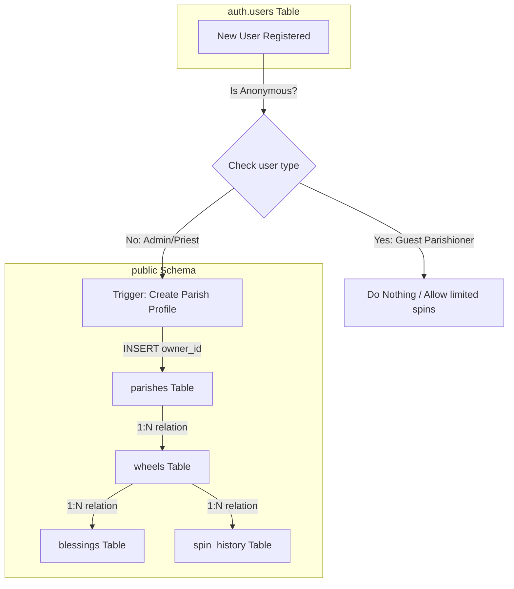

# THIẾT KẾ MAPPING DATABASE GIỮA `auth.users` VÀ CÁC BẢNG CƠ SỞ DỮ LIỆU CHUYÊN BIỆT (`parishes`, `wheels`)
**Dự án**: Vòng Quay Lời Chúa (Multi-tenant Parish Wheel)  
**Tác giả**: Antigravity Architect  
**Trạng thái**: Hoàn thiện & Khuyên dùng (Production-Ready)

---

## 1. TỔNG QUAN HỆ THỐNG & ĐỊNH DANH (SYSTEM OVERVIEW)

Hệ thống **Vòng Quay Lời Chúa** là nền tảng đa giáo xứ (Multi-tenant) phục vụ hai nhóm đối tượng người dùng với cơ chế định danh hoàn toàn khác nhau:

### 1.1. Giáo dân (Parishioner - End Users)
* **Hình thức định danh**: Định danh ẩn danh nhẹ nhàng thông qua **Supabase Anonymous Auth** (`signInAnonymously()`) kết hợp với **Browser Device Fingerprint** (MurmurHash3).
* **Mục đích**: Giáo dân có một User thực sự trong bảng `auth.users` (với thuộc tính `is_anonymous = true`) để thực thi bảo mật bằng **Row Level Security (RLS)** trên bảng lịch sử quay `spin_history` mà không cần nhập email hay mật khẩu.
* **Tác động DB**: **Không** tạo hồ sơ giáo xứ (`parishes`) cho nhóm này.

### 1.2. Quản trị viên / Cha xứ (Admin/Priest)
* **Hình thức định danh**: Đăng ký/Đăng nhập chính thức thông qua Email OTP hoặc Magic Link (Passwordless) trong `auth.users` (với thuộc tính `is_anonymous = false` và `email IS NOT NULL`).
* **Mục đích**: Quản lý cấu hình giáo xứ, thiết lập vòng quay (`wheels`), và quản trị danh sách lộc (`blessings`).
* **Tác động DB**: Tự động ánh xạ 1:1 hoặc 1:N với bảng giáo xứ (`parishes`) qua trường `owner_id`. Khi một tài khoản Cha xứ mới được kích hoạt, một cấu hình Giáo xứ mặc định phải được tự động khởi tạo.



---

## 2. LUỒNG ĐĂNG KÝ VÀ TỰ ĐỘNG KHỞI TẠO GIÁO XỨ (AUTO-MAPPING VIA TRIGGER)

Để đảm bảo tính nhất quán của dữ liệu đa chi nhánh, hệ thống sử dụng một **PostgreSQL Database Trigger** chạy dưới quyền `SECURITY DEFINER` trên bảng `auth.users` trong schema `auth`.

### 2.1. Cấu hình Metadata từ Client khi Đăng ký
Khi Cha xứ đăng ký tài khoản mới trên giao diện Dashboard, ứng dụng Client sẽ gửi thông tin đi kèm dưới dạng `options.data` (được lưu vào `raw_user_meta_data` trong database):
```typescript
const { data, error } = await supabase.auth.signUp({
  email: 'cha.xudoan@gmail.com',
  password: 'secure_password_123', // hoặc dùng Magic Link / OTP
  options: {
    data: {
      parish_name: 'Giáo xứ Hòa Bình',
      parish_slug: 'giao-xu-hoa-binh'
    }
  }
});
```

### 2.2. SQL DDL: Trigger tự động tạo Giáo xứ
Đoạn mã SQL sau đây định nghĩa hàm Trigger xử lý việc tách biệt tài khoản, xử lý slug tự động, giải quyết xung đột slug trùng lặp và lưu trữ liên kết:

```sql
-- =========================================================================
-- TRIGGER FUNCTION TO AUTOMATICALLY CREATE PARISH ON USER SIGNUP
-- Schema: public
-- Table Dependency: auth.users (triggers write to public.parishes)
-- Security: SECURITY DEFINER (Runs with database owner privileges)
-- =========================================================================

CREATE OR REPLACE FUNCTION public.handle_new_admin_user()
RETURNS TRIGGER AS $$
DECLARE
    v_parish_name TEXT;
    v_parish_slug TEXT;
    v_is_anonymous BOOLEAN;
    v_clean_slug TEXT;
    v_counter INTEGER := 1;
BEGIN
    -- 1. Xác định xem User có phải là tài khoản ẩn danh (Parishioner) hay không
    -- Supabase lưu trữ cờ is_anonymous trong auth.users (từ v2.0+) 
    -- Hoặc có thể kiểm tra qua provider trong raw_app_meta_data
    v_is_anonymous := COALESCE(
        NEW.is_anonymous, 
        (NEW.raw_app_meta_data->>'provider' = 'anonymous'), 
        FALSE
    );

    -- 2. Chỉ tạo Giáo xứ mới nếu đây là tài khoản Đăng ký chính thức (Admin/Priest)
    IF NOT v_is_anonymous THEN
        
        -- Lấy tên giáo xứ từ raw_user_meta_data hoặc fallback theo email
        v_parish_name := COALESCE(
            NEW.raw_user_meta_data->>'parish_name', 
            'Giáo xứ của ' || COALESCE(split_part(NEW.email, '@', 1), 'Admin')
        );

        -- Lấy slug mong muốn hoặc tự sinh dựa trên tên/email
        v_parish_slug := COALESCE(
            NEW.raw_user_meta_data->>'parish_slug',
            'giao-xu-' || LOWER(REGEXP_REPLACE(
                COALESCE(split_part(NEW.email, '@', 1), 'admin'), 
                '[^a-zA-Z0-9]', 
                '-', 
                'g'
            ))
        );

        -- Làm sạch slug để tránh ký tự thừa hoặc hai dấu gạch nối cạnh nhau
        v_clean_slug := REGEXP_REPLACE(v_parish_slug, '-+', '-', 'g');
        v_clean_slug := TRIM(BOTH '-' FROM v_clean_slug);
        v_parish_slug := v_clean_slug;

        -- 3. Giải quyết xung đột trùng lặp Slug (Collision Resolution)
        -- Nếu slug đã tồn tại, tự động nối thêm số thứ tự tăng dần hoặc chuỗi UUID rút gọn
        WHILE EXISTS (SELECT 1 FROM public.parishes WHERE slug = v_parish_slug) LOOP
            v_parish_slug := v_clean_slug || '-' || v_counter;
            v_counter := v_counter + 1;
            
            -- Tránh vòng lặp vô hạn trong trường hợp lỗi nặng
            IF v_counter > 100 THEN
                v_parish_slug := v_clean_slug || '-' || SUBSTRING(NEW.id::text FROM 1 FOR 8);
                EXIT;
            END IF;
        END LOOP;

        -- 4. Chèn thông tin giáo xứ vào bảng parishes
        INSERT INTO public.parishes (
            name, 
            slug, 
            owner_id, 
            status, 
            created_at, 
            updated_at
        )
        VALUES (
            v_parish_name, 
            v_parish_slug, 
            NEW.id, 
            'active', 
            CURRENT_TIMESTAMP, 
            CURRENT_TIMESTAMP
        );
        
    END IF;

    RETURN NEW;
EXCEPTION
    WHEN OTHERS THEN
        -- Ghi log lỗi PostgreSQL nếu có sự cố xảy ra để không làm nghẽn tiến trình đăng ký của Supabase Auth
        RAISE WARNING 'Lỗi trong handle_new_admin_user: % (SQLSTATE: %)', SQLERRM, SQLSTATE;
        RETURN NEW;
END;
$$ LANGUAGE plpgsql SECURITY DEFINER;

-- Đăng ký Trigger liên kết sau khi Insert vào auth.users
DROP TRIGGER IF EXISTS on_auth_user_created ON auth.users;
CREATE TRIGGER on_auth_user_created
    AFTER INSERT ON auth.users
    FOR EACH ROW
    EXECUTE FUNCTION public.handle_new_admin_user();
```

> [!IMPORTANT]
> Hàm Trigger cần chạy ở chế độ **`SECURITY DEFINER`** vì nó được kích hoạt bởi tiến trình nội bộ của Supabase Auth (chạy dưới role `supabase_auth_admin`) nhưng cần quyền ghi vào schema `public` (bảng `public.parishes`).

---

### 2.3. Script di chuyển dữ liệu & Map tài khoản Admin cũ (Migration Script)
Nếu hệ thống đã có sẵn các User cũ trong hệ thống nhưng chưa được khởi tạo Parish tương ứng, hãy chạy câu lệnh SQL Migration dưới đây để đồng bộ hóa:

```sql
-- =========================================================================
-- MIGRATION SCRIPT FOR MAPPING EXISTING USERS TO PARISHES
-- =========================================================================

INSERT INTO public.parishes (name, slug, owner_id, status)
SELECT 
    COALESCE(
        u.raw_user_meta_data->>'parish_name', 
        'Giáo xứ của ' || COALESCE(split_part(u.email, '@', 1), 'Cựu Admin')
    ) AS name,
    -- Tạo slug và nối thêm 8 ký tự đầu của UUID để tránh trùng lặp
    COALESCE(
        u.raw_user_meta_data->>'parish_slug', 
        'giao-xu-' || LOWER(REGEXP_REPLACE(COALESCE(split_part(u.email, '@', 1), 'admin'), '[^a-zA-Z0-9]', '-', 'g')) 
        || '-' || SUBSTRING(u.id::text FROM 1 FOR 8)
    ) AS slug,
    u.id AS owner_id,
    'active' AS status
FROM auth.users u
LEFT JOIN public.parishes p ON p.owner_id = u.id
WHERE 
    p.id IS NULL -- Chỉ những User chưa có Giáo xứ
    -- Loại trừ tài khoản Anonymous
    AND NOT COALESCE(u.is_anonymous, (u.raw_app_meta_data->>'provider' = 'anonymous'), FALSE);
```

---

## 3. CƠ CHẾ PHÂN TÁCH DỮ LIỆU ĐA CHI NHÁNH (MULTI-TENANT DATA SEGREGATION)

Đảm bảo an toàn dữ liệu đa chi nhánh (không bị rò rỉ chéo dữ liệu giữa các giáo xứ - Cross-tenant Data Leakage) được thực thi triệt để qua 3 tầng:

```
┌────────────────────────────────────────────────────────┐
│               1. CLIENT ACCESS LAYER                   │
│  - Routes: /giao-xu-an-nhon (Dynamic route matching)    │
│  - Config JSON: /configs/giao-xu-an-nhon/wheel.json     │
└───────────────────────────┬────────────────────────────┘
                            ▼
┌────────────────────────────────────────────────────────┐
│               2. DATABASE / RLS LAYER                  │
│  - Row Level Security (RLS) is ENABLED on all tables  │
│  - auth.uid() is matched with parishes.owner_id        │
└───────────────────────────┬────────────────────────────┘
                            ▼
┌────────────────────────────────────────────────────────┐
│                3. AUTHENTICATION STATE                 │
│  - Admin JWT contains identity of the Priest           │
│  - Anonymous Guest token identifies spin constraints   │
└────────────────────────────────────────────────────────┘
```

### 3.1. Phân tích Logic RLS (Row Level Security) cho từng bảng

Để ngăn chặn việc chỉnh sửa trái phép từ xa, các chính sách RLS phải tuân thủ nghiêm ngặt các quy tắc sau:

#### A. Bảng `parishes` (Quản lý Giáo xứ)
* **Quyền Đọc (SELECT)**: Bất kỳ ai cũng có thể đọc thông tin để đối chiếu Slug và cấu hình hiển thị vòng quay công cộng.
* **Quyền Ghi/Sửa/Xóa**: Chỉ tài khoản có `auth.uid() = owner_id` mới được thực hiện.

```sql
ALTER TABLE public.parishes ENABLE ROW LEVEL SECURITY;

CREATE POLICY "Allow public read parishes" ON public.parishes 
    FOR SELECT USING (true);

CREATE POLICY "Allow owner to insert parish" ON public.parishes 
    FOR INSERT WITH CHECK (auth.uid() = owner_id);

CREATE POLICY "Allow owner to update parish" ON public.parishes 
    FOR UPDATE USING (auth.uid() = owner_id) WITH CHECK (auth.uid() = owner_id);

CREATE POLICY "Allow owner to delete parish" ON public.parishes 
    FOR DELETE USING (auth.uid() = owner_id);
```

#### B. Bảng `wheels` (Quản lý cấu hình Vòng quay)
* **Quyền Đọc (SELECT)**:
  * Khách (Public) chỉ được xem những vòng quay đang kích hoạt (`is_active = true`).
  * Chủ sở hữu Giáo xứ (`parishes.owner_id = auth.uid()`) được xem toàn bộ vòng quay của giáo xứ mình (bao gồm cả các bản nháp/ngừng hoạt động).
* **Quyền Ghi/Sửa/Xóa**: Chỉ chủ sở hữu giáo xứ quản lý vòng quay này mới có quyền thao tác thông qua kiểm tra truy vấn chéo (`EXISTS`).

```sql
ALTER TABLE public.wheels ENABLE ROW LEVEL SECURITY;

CREATE POLICY "Allow public read active wheels or owner read all" ON public.wheels
    FOR SELECT USING (
        is_active = true 
        OR EXISTS (
            SELECT 1 FROM public.parishes 
            WHERE public.parishes.id = public.wheels.parish_id 
              AND public.parishes.owner_id = auth.uid()
        )
    );

CREATE POLICY "Allow parish owner to insert wheels" ON public.wheels
    FOR INSERT WITH CHECK (
        EXISTS (
            SELECT 1 FROM public.parishes 
            WHERE public.parishes.id = public.wheels.parish_id 
              AND public.parishes.owner_id = auth.uid()
        )
    );

CREATE POLICY "Allow parish owner to update wheels" ON public.wheels
    FOR UPDATE USING (
        EXISTS (
            SELECT 1 FROM public.parishes 
            WHERE public.parishes.id = public.wheels.parish_id 
              AND public.parishes.owner_id = auth.uid()
        )
    ) WITH CHECK (
        EXISTS (
            SELECT 1 FROM public.parishes 
            WHERE public.parishes.id = public.wheels.parish_id 
              AND public.parishes.owner_id = auth.uid()
        )
    );

CREATE POLICY "Allow parish owner to delete wheels" ON public.wheels
    FOR DELETE USING (
        EXISTS (
            SELECT 1 FROM public.parishes 
            WHERE public.parishes.id = public.wheels.parish_id 
              AND public.parishes.owner_id = auth.uid()
        )
    );
```

#### C. Bảng `blessings` (Lộc / Lời Chúa / Quà tặng)
* **Quyền Đọc (SELECT)**: Public có quyền đọc để render cung quay trên giao diện người dùng.
* **Quyền Ghi/Sửa/Xóa**: Chỉ cho phép thao tác nếu Vòng quay thuộc Giáo xứ do tài khoản hiện tại sở hữu.

```sql
ALTER TABLE public.blessings ENABLE ROW LEVEL SECURITY;

CREATE POLICY "Allow public read blessings" ON public.blessings
    FOR SELECT USING (true);

CREATE POLICY "Allow parish owner to insert blessings" ON public.blessings
    FOR INSERT WITH CHECK (
        EXISTS (
            SELECT 1 FROM public.wheels
            JOIN public.parishes ON public.parishes.id = public.wheels.parish_id
            WHERE public.wheels.id = blessings.wheel_id 
              AND public.parishes.owner_id = auth.uid()
        )
    );

CREATE POLICY "Allow parish owner to update blessings" ON public.blessings
    FOR UPDATE USING (
        EXISTS (
            SELECT 1 FROM public.wheels
            JOIN public.parishes ON public.parishes.id = public.wheels.parish_id
            WHERE public.wheels.id = blessings.wheel_id 
              AND public.parishes.owner_id = auth.uid()
        )
    ) WITH CHECK (
        EXISTS (
            SELECT 1 FROM public.wheels
            JOIN public.parishes ON public.parishes.id = public.wheels.parish_id
            WHERE public.wheels.id = blessings.wheel_id 
              AND public.parishes.owner_id = auth.uid()
        )
    );

CREATE POLICY "Allow parish owner to delete blessings" ON public.blessings
    FOR DELETE USING (
        EXISTS (
            SELECT 1 FROM public.wheels
            JOIN public.parishes ON public.parishes.id = public.wheels.parish_id
            WHERE public.wheels.id = blessings.wheel_id 
              AND public.parishes.owner_id = auth.uid()
        )
    );
```

#### D. Bảng `spin_history` (Lịch sử lượt quay)
* **Quyền Ghi (INSERT)**: Khách vãng lai/Anonymous được phép chèn log để ghi nhận kết quả quay thưởng.
* **Quyền Đọc (SELECT)**: Chỉ có Cha xứ của giáo xứ tương ứng mới được đọc để xem báo cáo thống kê lượt quay và thông tin nhận quà.
* **Quyền Cập nhật / Xóa**: Bị cấm hoàn toàn (`No Policy` được định nghĩa) để đảm bảo tính toàn vẹn và không thể làm giả dữ liệu lịch sử quay.

```sql
ALTER TABLE public.spin_history ENABLE ROW LEVEL SECURITY;

CREATE POLICY "Allow anonymous or public insert spin_history" ON public.spin_history
    FOR INSERT WITH CHECK (true);

CREATE POLICY "Allow parish owners to select spin_history" ON public.spin_history
    FOR SELECT USING (
        EXISTS (
            SELECT 1 FROM public.wheels
            JOIN public.parishes ON public.parishes.id = public.wheels.parish_id
            WHERE public.wheels.id = spin_history.wheel_id 
              AND public.parishes.owner_id = auth.uid()
        )
    );
```

---

## 4. KỊCH BẢN KIỂM THỬ & XÁC MINH HỆ THỐNG (TESTING & VERIFICATION)

Để đảm bảo các Trigger và RLS hoạt động hoàn hảo trước khi deploy lên môi trường Production, hãy chạy các kịch bản kiểm thử sau trong môi trường Database Sandbox (Supabase SQL Editor):

### 4.1. Bước 1: Giả lập đăng ký Cha xứ mới
Chèn trực tiếp một bản ghi giả lập vào bảng `auth.users` đóng vai trò là một tài khoản đăng ký chính thống:

```sql
-- 1. Chèn mock user cha xứ mới vào auth.users
INSERT INTO auth.users (
    id, 
    email, 
    is_anonymous, 
    raw_user_meta_data, 
    raw_app_meta_data,
    created_at
)
VALUES (
    'a0eebc99-9c0b-4ef8-bb6d-6bb9bd380a11', 
    'cha.xu.tan.dinh@example.com', 
    FALSE, 
    '{"parish_name": "Giáo xứ Tân Định", "parish_slug": "giao-xu-tan-dinh"}'::jsonb,
    '{"provider": "email"}'::jsonb,
    CURRENT_TIMESTAMP
);

-- 2. Truy vấn kiểm tra xem Trigger có tự tạo Parish hay không
SELECT id, name, slug, owner_id, status 
FROM public.parishes 
WHERE owner_id = 'a0eebc99-9c0b-4ef8-bb6d-6bb9bd380a11';

-- KẾT QUẢ MONG ĐỢI:
-- Trả về 1 dòng dữ liệu với slug = 'giao-xu-tan-dinh' và status = 'active'
```

### 4.2. Bước 2: Giả lập xử lý Slug trùng lặp (Collision Check)
Đăng ký một user khác có cùng thông tin slug để kiểm tra tính năng tự động cộng dồn hậu tố:

```sql
-- 1. Chèn mock user thứ 2 có cùng metadata slug trùng
INSERT INTO auth.users (
    id, 
    email, 
    is_anonymous, 
    raw_user_meta_data, 
    raw_app_meta_data,
    created_at
)
VALUES (
    'b0eebc99-9c0b-4ef8-bb6d-6bb9bd380a22', 
    'cha.phu.tan.dinh@example.com', 
    FALSE, 
    '{"parish_name": "Nhà thờ Tân Định Nhóm 2", "parish_slug": "giao-xu-tan-dinh"}'::jsonb,
    '{"provider": "email"}'::jsonb,
    CURRENT_TIMESTAMP
);

-- 2. Xem kết quả xử lý slug trùng lặp
SELECT id, name, slug, owner_id 
FROM public.parishes 
WHERE owner_id = 'b0eebc99-9c0b-4ef8-bb6d-6bb9bd380a22';

-- KẾT QUẢ MONG ĐỢI:
-- Trả về 1 dòng dữ liệu với slug = 'giao-xu-tan-dinh-1' (hệ thống tự cộng 1)
```

### 4.3. Bước 3: Giả lập đăng ký User ẩn danh (Giáo dân)
Đảm bảo tài khoản giáo dân ẩn danh KHÔNG sinh ra bản ghi Parish:

```sql
-- 1. Chèn mock user ẩn danh
INSERT INTO auth.users (
    id, 
    email, 
    is_anonymous, 
    raw_user_meta_data, 
    raw_app_meta_data,
    created_at
)
VALUES (
    'c0eebc99-9c0b-4ef8-bb6d-6bb9bd380a33', 
    NULL, -- Anonymous không có email
    TRUE, 
    '{}'::jsonb,
    '{"provider": "anonymous"}'::jsonb,
    CURRENT_TIMESTAMP
);

-- 2. Truy vấn kiểm tra
SELECT count(*) 
FROM public.parishes 
WHERE owner_id = 'c0eebc99-9c0b-4ef8-bb6d-6bb9bd380a33';

-- KẾT QUẢ MONG ĐỢI:
-- Trả về số lượng: 0 (Đúng thiết kế)
```

### 4.4. Bước 4: Kiểm tra bảo mật RLS bằng cách giả lập Role
Thực hiện giả lập truy vấn bằng tài khoản cha xứ này để xem RLS chặn truy cập chéo ra sao:

```sql
-- Thiết lập Session Role tương ứng với Cha xứ Tân Định
SET LOCAL request.jwt.claim.sub = 'a0eebc99-9c0b-4ef8-bb6d-6bb9bd380a11';
SET ROLE authenticated;

-- Thử chèn một Vòng quay cho Giáo xứ Tân Định (HỢP LỆ)
-- Giả sử ID Giáo xứ Tân Định ở Bước 1 là 'p1-uuid...' ta thay bằng SELECT động
INSERT INTO public.wheels (parish_id, title, config)
VALUES (
    (SELECT id FROM public.parishes WHERE owner_id = 'a0eebc99-9c0b-4ef8-bb6d-6bb9bd380a11'),
    'Vòng Quay Lộc Xuân 2026',
    '{"theme": "red"}'::jsonb
);

-- Thử chèn một Vòng quay cho Giáo xứ Khác (BỊ CHẶN BỞI RLS)
-- User 'a0eebc99-9c0b-4ef8-bb6d-6bb9bd380a11' cố tình chèn vào Giáo xứ của 'b0eebc99-9c0b-4ef8-bb6d-6bb9bd380a22'
INSERT INTO public.wheels (parish_id, title, config)
VALUES (
    (SELECT id FROM public.parishes WHERE owner_id = 'b0eebc99-9c0b-4ef8-bb6d-6bb9bd380a22'),
    'Hacker Wheel',
    '{"theme": "dark"}'::jsonb
);

-- KẾT QUẢ MONG ĐỢI:
-- Câu lệnh INSERT thứ nhất thành công.
-- Câu lệnh INSERT thứ hai thất bại do vi phạm chính sách Row Level Security (new row violates row-level security policy for table "wheels").
```

### 4.5. Dọn dẹp Mock Data sau kiểm thử
```sql
DELETE FROM public.wheels WHERE title IN ('Vòng Quay Lộc Xuân 2026', 'Hacker Wheel');
DELETE FROM public.parishes WHERE owner_id IN ('a0eebc99-9c0b-4ef8-bb6d-6bb9bd380a11', 'b0eebc99-9c0b-4ef8-bb6d-6bb9bd380a22');
DELETE FROM auth.users WHERE id IN ('a0eebc99-9c0b-4ef8-bb6d-6bb9bd380a11', 'b0eebc99-9c0b-4ef8-bb6d-6bb9bd380a22', 'c0eebc99-9c0b-4ef8-bb6d-6bb9bd380a33');
```
