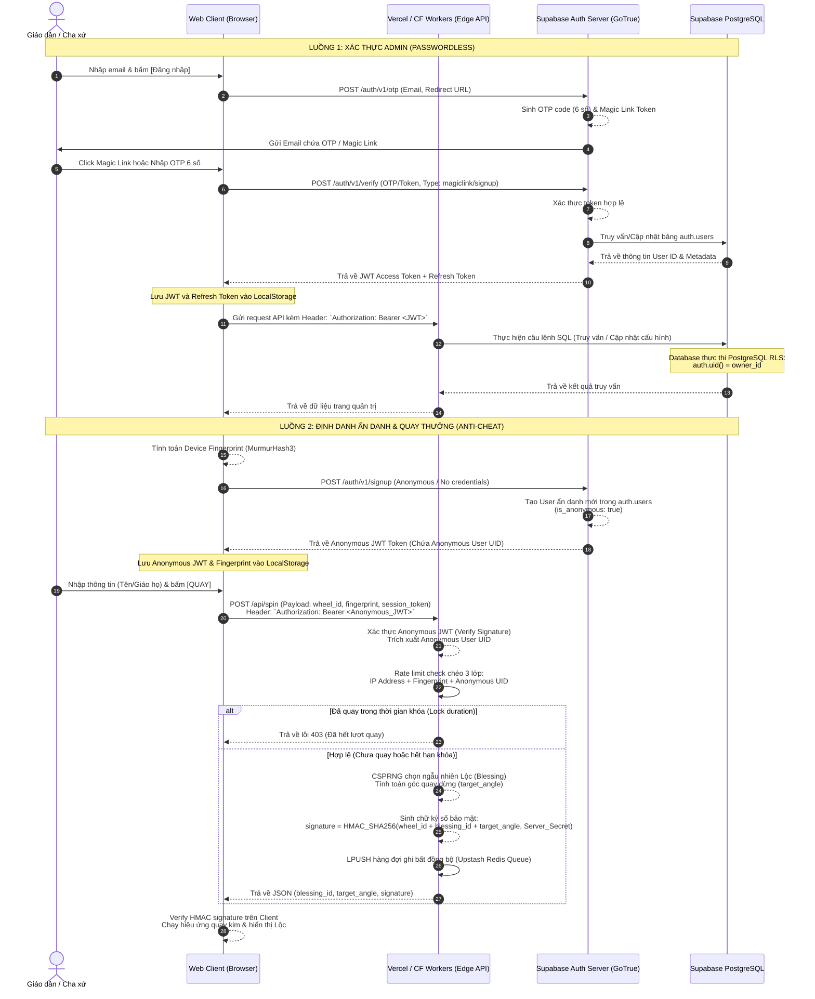

# TÀI LIỆU LUỒNG DỮ LIỆU XÁC THỰC TOÀN DIỆN (END-TO-END AUTH DATAFLOW SPECIFICATION)

**Dự án**: Vòng Quay Lời Chúa (Bảy Ơn Chúa Thánh Thần)  
**Tài liệu**: Thiết kế & Tích hợp Luồng dữ liệu Xác thực (Authentication & Authorization E2E Spec)  
**Trạng thái**: Hoàn thiện Tích hợp  

---

## 1. KIẾN TRÚC LUỒNG DỮ LIỆU XÁC THỰC TỔNG THỂ (OVERVIEW)

Hệ thống phân tách luồng xác thực thành hai nhánh rõ rệt tương ứng với hai đối tượng người dùng:
1. **Admin (Cha xứ / Quản trị viên)**: Sử dụng cơ chế đăng nhập không mật khẩu (**Passwordless Email OTP & Magic Link**) của Supabase Auth. Phiên đăng nhập được quản lý bằng JSON Web Tokens (JWT) có chữ ký số mã hóa và lưu tại Client LocalStorage. Quyền quản trị dữ liệu được bảo vệ nghiêm ngặt ở tầng cơ sở dữ liệu bằng **PostgreSQL Row Level Security (RLS)**.
2. **Giáo dân (Parishioner)**: Sử dụng cơ chế định danh ẩn danh **Supabase Anonymous Auth** kết hợp với **Browser Device Fingerprinting** (thuật toán MurmurHash3 từ Canvas/WebGL/User-Agent). Sự kết hợp này tạo ra một thực thể định danh duy nhất trong `auth.users` mà không bắt giáo dân phải nhập thông tin cá nhân phức tạp, đồng thời cho phép backend áp dụng RLS để bảo vệ và chống cheat kết quả quay thưởng.

---

## 2. BIỂU ĐỒ MERMAID LUỒNG DỮ LIỆU & TOKEN (DATAFLOW & TOKEN FLOW)

Dưới đây là sơ đồ Mermaid chi tiết mô tả đường đi của các yêu cầu (Requests), dữ liệu và các loại mã xác thực (Tokens/Signatures) qua 4 tầng kiến trúc: **Client**, **Edge API Gateway (Vercel Serverless / Cloudflare Worker)**, **Supabase Auth Server (GoTrue)** và **Supabase PostgreSQL**.



---

## 3. NHẬT KÝ THỰC THI THEO THỜI GIAN (CHRONOLOGICAL EXECUTION TRACE)

### 3.1. Kịch bản A: Đăng ký & Kích hoạt tài khoản Admin (Admin Registration & Onboarding)
Kịch bản này xảy ra khi một Cha xứ mới đăng ký tài khoản quản trị hệ thống vòng quay giáo xứ của mình.

| Thời gian (ms) | Tác nhân | Thành phần nguồn | Thành phần đích | Hành động chi tiết | Trạng thái dữ liệu & Token |
| :--- | :--- | :--- | :--- | :--- | :--- |
| `0` | Cha xứ | Trình duyệt (Client) | Supabase Auth | Gửi request đăng ký tài khoản admin thông qua API `supabase.auth.signUp({ email, password })` hoặc qua API đăng ký nội bộ. | Dữ liệu gửi đi: `{ email: "chaxu@tan-dinh.org" }`. |
| `120` | Hệ thống | Supabase Auth | Supabase Postgres | Tạo một bản ghi mới trong bảng hệ thống `auth.users` với email tương ứng. Trạng thái email chưa được xác minh (`email_confirmed_at: null`). | Sinh ra UUID của Admin: `admin_id: "a1b2c3d4-..."`. |
| `150` | Hệ thống | Supabase Auth | Hộp thư của Cha xứ | Gửi một Email xác thực tài khoản chứa token xác minh (Confirmation Link) đến địa chỉ email đã đăng ký. | Token hết hạn sau 24 giờ. |
| `~` | Cha xứ | Email Client | Supabase Auth | Cha xứ mở email và click vào link xác nhận. Trình duyệt chuyển hướng đến endpoint `/auth/v1/verify` của Supabase. | Gửi kèm token xác thực trong URL. |
| `~ + 80` | Hệ thống | Supabase Auth | Supabase Postgres | Xác thực token thành công. Cập nhật trường `email_confirmed_at` bằng timestamp hiện tại và kích hoạt tài khoản. | Cập nhật `auth.users.confirmed_at = NOW()`. |
| `~ + 120` | Hệ thống | Supabase Auth | Trình duyệt (Client) | Chuyển hướng người dùng về trang Dashboard và trả về JWT Access Token cùng Refresh Token. | JWT chứa thông tin payload: `{ sub: admin_id, email: chaxu@tan-dinh.org, role: "authenticated" }`. |
| `~ + 200` | Hệ thống | Trình duyệt (Client) | Vercel API `/api/parish` | Client gửi yêu cầu tạo mới Giáo xứ kèm theo tên giáo xứ và slug. Request đi kèm header `Authorization: Bearer <JWT>`. | Gửi payload: `{ name: "Giáo xứ Tân Định", slug: "tan-dinh" }`. |
| `~ + 300` | Hệ thống | Vercel API | Supabase Postgres | Thực hiện lệnh `INSERT INTO parishes (name, slug, owner_id) VALUES (...)`. Cơ sở dữ liệu kiểm tra RLS (Cho phép INSERT nếu người dùng có session hợp lệ). | Bản ghi mới được ghi nhận trong bảng `parishes` với `owner_id = auth.uid()`. |

---

### 3.2. Kịch bản B: Đăng nhập Passwordless Magic Link / OTP của Admin (Admin Login)
Kịch bản này xảy ra khi Cha xứ đăng nhập lại vào hệ thống để thay đổi cấu hình vòng quay.

| Thời gian (ms) | Tác nhân | Thành phần nguồn | Thành phần đích | Hành động chi tiết | Trạng thái dữ liệu & Token |
| :--- | :--- | :--- | :--- | :--- | :--- |
| `0` | Cha xứ | Trình duyệt (Client) | Supabase Auth | Cha xứ nhập email vào giao diện và nhấn nút "Đăng nhập". Client gọi hàm `supabase.auth.signInWithOtp({ email })`. | Gửi payload: `{ email: "chaxu@tan-dinh.org" }`. |
| `100` | Hệ thống | Supabase Auth | Dịch vụ SMTP Email | Sinh mã OTP 6 chữ số ngẫu nhiên cùng Token liên kết Magic Link, sau đó gửi qua email của Cha xứ. | Mã OTP lưu tạm thời trên Supabase Auth (hết hạn sau 5 phút). |
| `~` | Cha xứ | Trình duyệt (Client) | Supabase Auth | **Cách 1**: Cha xứ nhập mã OTP 6 số vào trang web.<br>**Cách 2**: Cha xứ click trực tiếp vào Magic Link trong email để tự động đăng nhập. | Gửi yêu cầu xác thực OTP/Magic Token lên `/auth/v1/verify`. |
| `~ + 150` | Hệ thống | Supabase Auth | Trình duyệt (Client) | Xác thực mã OTP/Token khớp với bản ghi tạm thời. Cấp mới bộ đôi Token: JWT Access Token (hết hạn sau 1 giờ) và Refresh Token (hết hạn sau 7 ngày). | Lưu trữ Token vào LocalStorage dưới key `sb-[supabase-project-id]-auth-token`. |
| `~ + 250` | Cha xứ | Trình duyệt (Client) | Vercel API `/api/wheels` | Admin sửa cấu hình Vòng quay (ví dụ: đổi theme từ "Light" sang "Tet") và bấm "Lưu". Client gửi request PUT kèm JWT trong header. | Header: `Authorization: Bearer <Admin_JWT>`. |
| `~ + 350` | Hệ thống | Vercel API | Supabase Postgres | Vercel API giải mã JWT để lấy `admin_id` rồi thực hiện câu lệnh SQL UPDATE cấu hình. Postgres kiểm tra RLS policy của bảng `wheels`. | RLS Policy: `EXISTS (SELECT 1 FROM parishes WHERE parishes.id = wheels.parish_id AND parishes.owner_id = auth.uid())` trả về `TRUE`. |
| `~ + 400` | Hệ thống | Supabase Postgres | Vercel API | Câu lệnh UPDATE thực thi thành công, trả về trạng thái HTTP 200 OK cùng dữ liệu đã cập nhật. | Trạng thái DB được cập nhật. |
| `~ + 450` | Hệ thống | Vercel API | Trình duyệt (Client) | Trả kết quả thành công về giao diện admin. Giao diện hiển thị thông báo "Đồng bộ cấu hình thành công". | Client đồng bộ lại trạng thái Local Draft. |

---

### 3.3. Kịch bản C: Định danh ẩn danh & Quay thưởng của Giáo dân (Parishioner Anonymous Authentication & Spin Engine)
Kịch bản này xảy ra khi giáo dân truy cập vào đường dẫn vòng quay của giáo xứ để quay lấy Lộc Lời Chúa.

| Thời gian (ms) | Tác nhân | Thành phần nguồn | Thành phần đích | Hành động chi tiết | Trạng thái dữ liệu & Token |
| :--- | :--- | :--- | :--- | :--- | :--- |
| `0` | Giáo dân | Trình duyệt (Client) | Client LocalStorage | Giáo dân truy cập vào link vòng quay. Client kiểm tra xem đã có session token ẩn danh trong LocalStorage chưa. | Kiểm tra key `vqlc_anonymous_session`. Giả sử chưa có (lần đầu truy cập). |
| `20` | Hệ thống | Trình duyệt (Client) | Thiết bị phần cứng | Chạy bộ mã hóa **MurmurHash3 Fingerprint Engine**: Vẽ đối tượng Canvas ẩn, truy vấn WebGL debug renderer, đọc kích thước màn hình, múi giờ và User-Agent để tạo mã hash 32-bit duy nhất của thiết bị. | Trích xuất thành công chuỗi hash: `fingerprint: "5d65cd8b"`. |
| `50` | Hệ thống | Trình duyệt (Client) | Supabase Auth | Gọi hàm `supabase.auth.signInAnonymously()` để thực hiện đăng ký ẩn danh. | Supabase Auth nhận yêu cầu, không cần thông tin đăng nhập. |
| `180` | Hệ thống | Supabase Auth | Supabase Postgres | Tạo một bản ghi mới trong bảng `auth.users` với cờ `is_anonymous: true`. | Lưu User ẩn danh mới vào DB: `anon_id: "e5f6g7h8-..."`. |
| `220` | Hệ thống | Supabase Auth | Trình duyệt (Client) | Trả về Anonymous JWT Access Token chứa ID ẩn danh của người dùng. | Lưu token vào LocalStorage dưới key `vqlc_anonymous_session`. |
| `~` | Giáo dân | Trình duyệt (Client) | Vercel API `/api/spin` | Giáo dân nhập tên "Nguyễn Văn A" và bấm **[QUAY]**. Client gửi request POST lên `/api/spin` kèm theo `wheel_id`, `fingerprint` và JWT Token trong Header. | Payload: `{ wheel_id: "w123", fingerprint: "5d65cd8b", name: "Nguyễn Văn A" }`. |
| `~ + 80` | Hệ thống | Vercel API (Edge) | Redis Cache (Upstash) | Edge Worker giải mã JWT bằng `JWT_SECRET`, lấy ra `anon_id`. Thực hiện kiểm tra rate-limit chéo 3 lớp bằng cách truy vấn Redis: kiểm tra xem bộ ba `{ IP, fingerprint, anon_id }` đã tồn tại trong khóa rate limit của `wheel_id` chưa. | Redis Key check: `spin_lock:w123:5d65cd8b` hoặc `spin_lock:w123:anon_id` hoặc `spin_lock:w123:IP`. |
| `~ + 100` | Hệ thống | Vercel API (Edge) | Vercel API (Edge) | Giả thiết chưa bị giới hạn (Rate limit OK). Edge Worker gọi hàm `crypto.getRandomValues()` (CSPRNG bảo mật) để chọn ngẫu nhiên một Blessing trong danh sách đã tải từ trước, đồng thời tính toán góc quay dừng. | Lộc trúng: `blessing_id: "b999"`, Góc quay: `target_angle: 144`. |
| `~ + 110` | Hệ thống | Vercel API (Edge) | Vercel API (Edge) | Edge Worker sinh mã chữ ký HMAC bảo mật để tránh client chỉnh sửa kết quả hoặc tự gửi request ghi nhận lộc tùy ý. | Chữ ký: `signature = HMAC_SHA256("w123:b999:144", Server_Secret)`. |
| `~ + 120` | Hệ thống | Vercel API (Edge) | Redis Queue (Upstash) | Edge Worker đẩy lịch sử lượt quay vào Redis queue thông qua lệnh `LPUSH spin_queue <json_payload>` để lưu trữ bất đồng bộ, tránh chặn luồng của giáo dân. | Payload queue: `{ spin_id, wheel_id, blessing_id, name, IP, fingerprint, anon_id, created_at }`. |
| `~ + 130` | Hệ thống | Vercel API (Edge) | Trình duyệt (Client) | Edge Worker phản hồi JSON kết quả quay về cho Client. Kết nối mạng kết thúc chỉ trong ~130ms. | Trả về: `{ blessing_id: "b999", target_angle: 144, signature: "hmac_hash..." }`. |
| `~ + 150` | Hệ thống | Trình duyệt (Client) | Trình duyệt (Client) | Client giải mã và tự kiểm tra chữ ký HMAC bằng public key (hoặc client-side code xác thực lại format). Chạy hiệu ứng quay vòng quay bằng góc dừng `144` độ và hiển thị Lộc Lời Chúa trên màn hình. | Hiển thị Lộc Lời Chúa tương ứng với ID `b999`. |
| `~ + 5000` | Hệ thống | CF Worker Cron | Supabase Postgres | Sync Worker (chạy định kỳ 5s) gọi lệnh `LRANGE spin_queue 0 199` để lấy danh sách lượt quay và thực hiện một lệnh **Bulk Insert** duy nhất vào bảng `spin_history` trong PostgreSQL. | Thực thi bulk ghi nhận kết quả. Rút hết hàng đợi của Redis. |

---

## 4. CƠ CHẾ BẢO MẬT CHỐNG GIAN LẬN NÂNG CAO (ANTI-CHEAT & INTEGRITY MECHANISMS)

Để đảm bảo tính công bằng và chống lại các hành vi gian lận (ví dụ: viết script tự động quay liên tục, sửa đổi góc quay của client để lấy lộc đẹp, giả mạo ID người dùng), hệ thống triển khai cơ chế bảo mật đa lớp tại Edge Layer:

### 4.1. Xác thực Chữ ký Kết quả (Cryptographic Result Signature)
Client **không bao giờ** được phép tự quyết định kết quả quay. Luồng hoạt động như sau:
1. Khi giáo dân click Quay, client chỉ gửi sự kiện yêu cầu.
2. Edge Worker sử dụng thuật toán ngẫu nhiên bảo mật của hệ điều hành (**CSPRNG**) để tính toán kết quả Lộc và góc quay tương ứng.
3. Edge Worker ký mã hóa kết quả bằng **HMAC-SHA256** với một khóa bí mật chỉ lưu trên Server (`Server_Secret`):
   $$\text{Signature} = \text{HMAC-SHA256}(\text{wheel\_id} \parallel \text{blessing\_id} \parallel \text{target\_angle}, \text{Server\_Secret})$$
4. Trình duyệt client nhận kết quả và chữ ký, verify chữ ký trước khi kích hoạt hiệu ứng dừng kim. Bất kỳ sự can thiệp nào vào biến số `target_angle` hay `blessing_id` ở client sẽ làm chữ ký không khớp, client sẽ phát hiện và từ chối hiển thị kết quả.

### 4.2. Chốt chặn Rate-Limit 3 Tầng (Three-Tier Rate Limiting)
Khi kiểm tra giới hạn lượt quay (ví dụ: mỗi người chỉ được quay 1 lần trong 24 giờ), backend tại Edge Function sẽ thực hiện đối chiếu chéo cả 3 thông số định danh từ request gửi lên:
1. **Anonymous User UID (`auth.uid()`)**: Lấy trực tiếp từ token JWT ẩn danh đã qua xác thực của Supabase Auth.
2. **Device Fingerprint Hash**: Được tạo ra từ các thuộc tính phần cứng của trình duyệt (MurmurHash3). Dù người dùng có xóa cookie hay đổi địa chỉ IP, vân tay thiết bị phần cứng vẫn không đổi.
3. **Client IP Address**: Trích xuất từ các header của Edge Gateway (`x-forwarded-for`, `cf-connecting-ip`). Dùng để chặn trường hợp một thiết bị cố tình spam bằng cách thay đổi User-Agent để đổi vân tay ảo nhưng chung đường mạng.

```
Request → [Kiểm tra IP trong Redis/DB] ──(Đã quay?)──> [Từ chối (403)]
        ↓
  [Kiểm tra Fingerprint trong Redis/DB] ──(Đã quay?)──> [Từ chối (403)]
        ↓
  [Kiểm tra Anonymous UID trong Redis/DB] ──(Đã quay?)──> [Từ chối (403)]
        ↓
  [Cho phép Quay & Ghi nhận cả 3 thông số định danh vào Lịch sử]
```

---

## 5. THIẾT LẬP PHÂN QUYỀN TRÊN SUPABASE DATABASE (RLS POLICIES)

Mọi bảng dữ liệu trong Supabase PostgreSQL đều được kích hoạt **Row Level Security (RLS)** để đảm bảo an toàn tuyệt đối ở tầng cơ sở dữ liệu. Các chính sách phân quyền chi tiết được định nghĩa dưới đây:

### 5.1. Bảng Giáo xứ (`parishes`)
* **Chính sách đọc (SELECT)**: Public có quyền đọc thông tin giáo xứ để hiển thị giao diện.
  ```sql
  CREATE POLICY "Allow public read active parishes" ON parishes
      FOR SELECT USING (status = 'active');
  ```
* **Chính sách thay đổi (ALL - INSERT/UPDATE/DELETE)**: Chỉ có tài khoản Admin là chủ sở hữu của giáo xứ đó mới được thao tác.
  ```sql
  CREATE POLICY "Allow modify for parish owner" ON parishes
      FOR ALL TO authenticated
      USING (owner_id = auth.uid())
      WITH CHECK (owner_id = auth.uid());
  ```

### 5.2. Bảng Vòng Quay (`wheels`)
* **Chính sách đọc (SELECT)**: Public có quyền đọc các vòng quay đang kích hoạt.
  ```sql
  CREATE POLICY "Allow public read active wheels" ON wheels
      FOR SELECT USING (is_active = true);
  ```
* **Chính sách thay đổi (ALL)**: Chỉ Admin quản lý giáo xứ chứa vòng quay này mới được quyền chỉnh sửa.
  ```sql
  CREATE POLICY "Allow modify wheels for parish admin" ON wheels
      FOR ALL TO authenticated
      USING (
          EXISTS (
              SELECT 1 FROM parishes
              WHERE parishes.id = wheels.parish_id AND parishes.owner_id = auth.uid()
          )
      );
  ```

### 5.3. Bảng Lộc / Lời Chúa (`blessings` hoặc `gifts`)
* **Chính sách đọc (SELECT)**: Public có quyền đọc danh sách quà/lộc của vòng quay.
  ```sql
  CREATE POLICY "Allow public read blessings" ON blessings
      FOR SELECT USING (
          EXISTS (
              SELECT 1 FROM wheels
              WHERE wheels.id = blessings.wheel_id AND wheels.is_active = true
          )
      );
  ```
* **Chính sách thay đổi (ALL)**: Chỉ Admin quản lý vòng quay đó mới được chỉnh sửa.
  ```sql
  CREATE POLICY "Allow modify blessings for wheel admin" ON blessings
      FOR ALL TO authenticated
      USING (
          EXISTS (
              SELECT 1 FROM wheels
              JOIN parishes ON parishes.id = wheels.parish_id
              WHERE wheels.id = blessings.wheel_id AND parishes.owner_id = auth.uid()
          )
      );
  ```

### 5.4. Bảng Lịch sử quay (`spin_history`)
* **Chính sách đọc (SELECT)**: Giáo dân ẩn danh chỉ được xem lịch sử quay của chính mình (`auth.uid() = session_id`). Admin được xem toàn bộ lịch sử quay thuộc các vòng quay của giáo xứ mình quản lý.
  ```sql
  CREATE POLICY "Allow parishioners to view their own spin history" ON spin_history
      FOR SELECT TO authenticated
      USING (session_id = auth.uid()::text);

  CREATE POLICY "Allow admin to view all spins in their parish" ON spin_history
      FOR SELECT TO authenticated
      USING (
          EXISTS (
              SELECT 1 FROM wheels
              JOIN parishes ON parishes.id = wheels.parish_id
              WHERE wheels.id = spin_history.wheel_id AND parishes.owner_id = auth.uid()
          )
      );
  ```
* **Chính sách thêm mới (INSERT)**: Do các bản ghi lịch sử được ghi nhận qua **Sync Worker** (chạy bằng API có quyền hạn cao - `service_role` để tránh nghẽn luồng và bypass RLS bảo mật), chính sách ghi bình thường của Client được khóa lại để chống ghi đè trực tiếp từ client.
  ```sql
  -- Khóa hoàn toàn quyền INSERT trực tiếp từ Client để tránh bypass Edge API
  CREATE POLICY "Block client insert on spin history" ON spin_history
      FOR INSERT WITH CHECK (false);
  ```
