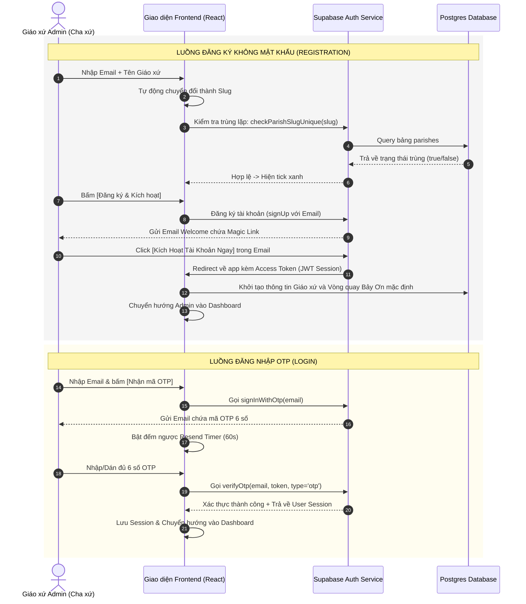
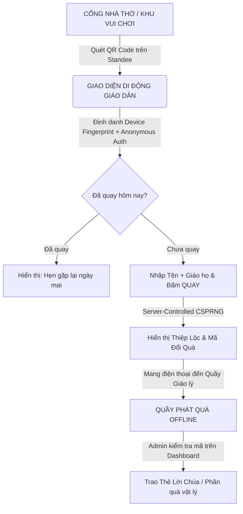

# THIẾT KẾ TRẢI NGHIỆM NGƯỜI DÙNG (UX SPEC): HỆ THỐNG XÁC THỰC KHÔNG MẬT KHẨU (PASSWORDLESS)
**Dự án**: Vòng Quay Lời Chúa (Parish Wheel Platform)  
**Vai trò thiết kế**: Lead UI/UX & Conversion Optimization Specialist  
**Mục tiêu**: Loại bỏ hoàn toàn sự phức tạp của mật khẩu truyền thống đối với các Cha xứ và Giáo xứ Admin, tối đa hóa tỷ lệ chuyển đổi đăng ký (Register Conversion Rate) và đơn giản hóa quy trình đăng nhập (Login Frictionless Flow).

---

## 1. QUY TRÌNH ĐĂNG KÝ (REGISTRATION UX FLOW)

Mục tiêu chính của quy trình đăng ký là đưa Admin (Cha xứ, Ban hành giáo) đi qua các bước nhanh nhất để nhận ngay "Thành quả mơ ước" (Vòng quay hoạt động ngay lập tức của riêng giáo xứ họ).

### 1.1. Giao diện Đăng ký (Registration UI/UX Details)
*   **Thiết kế tối giản**: Chỉ yêu cầu 3 thông tin cốt lõi thay vì bắt nhập mật khẩu 2 lần.
    1.  **Email quản trị viên** (`email`): Địa chỉ nhận Magic Link kích hoạt tài khoản.
    2.  **Tên Giáo xứ / Cộng đoàn** (`parishName`): Ví dụ: *Giáo xứ Châu Sơn*, *Cộng đoàn Giới Trẻ Tận Hiến*.
    3.  **Đường dẫn chia sẻ (Slug URL)**: Định dạng trực quan hiển thị bên dưới ô nhập: `vongquayloichua.com/giao-xu/[slug]`.
*   **Hành động tự động & Live Validation**:
    *   **Auto-slugify**: Khi người dùng gõ vào ô "Tên Giáo xứ", hệ thống tự động làm sạch ký tự tiếng Việt (loại bỏ dấu, ký tự đặc biệt, chuyển khoảng trắng thành dấu `-`, chuyển chữ thường) và hiển thị live ở ô "Đường dẫn chia sẻ".
    *   **Debounce API Check (500ms)**: Khi người dùng dừng gõ ô Slug quá 500ms, hệ thống tự động gọi API `checkParishSlugUnique` lên cơ sở dữ liệu.
    *   **Trạng thái trực quan của Slug**:
        *   *Hợp lệ*: Icon tích xanh lá kèm dòng chữ nhỏ: `"Đường dẫn hợp lệ & sẵn sàng!"`.
        *   *Trùng lặp*: Icon cảnh báo đỏ kèm dòng chữ nhỏ: `"Đường dẫn này đã có giáo xứ sử dụng. Đang gợi ý..."` -> Hệ thống tự động thêm hậu tố vùng miền hoặc số ngẫu nhiên vào sau slug (Ví dụ: `chau-son-bmt` hoặc `chau-son-1`) để giúp Admin tiếp tục mà không bị nghẽn luồng.

### 1.2. Quy trình gửi Magic Link kích hoạt (Registration Verification)
1.  Người dùng bấm **[Đăng ký & Kích hoạt miễn phí]** (Nút CTA lớn màu Gold tôn nghiêm).
2.  Hệ thống gọi Supabase Auth API gửi yêu cầu OTP / Magic Link đến email đã điền.
3.  **Màn hình chuyển tiếp (Confirmation Page)**:
    *   Hiển thị hình vẽ minh họa hòm thư gửi đi kèm thông điệp: *"Chúng con đã gửi một liên kết kích hoạt đến email **cha-xu@gmail.com**."*
    *   **Nút tắt thông minh**: `[Mở ứng dụng Gmail]` hoặc `[Mở Outlook]` tự động nhận diện thiết bị để mở nhanh app mail tương ứng giúp giáo xứ đỡ mất công tìm kiếm.
4.  Khi Admin mở email và click vào nút **[Kích Hoạt Tài Khoản Ngay]**, hệ thống Supabase tự động xác thực token, khởi tạo cấu hình Giáo xứ + Vòng quay mặc định (Bảy Ơn Chúa Thánh Thần) trong DB, và tự động chuyển hướng thẳng vào **Admin Dashboard** với session đã được thiết lập.

---

## 2. QUY TRÌNH ĐĂNG NHẬP (LOGIN UX FLOW)

Đơn giản tối đa, không cần nhớ mật khẩu. Đăng nhập chỉ bằng Email và mã OTP 6 chữ số gửi qua hộp thư.

### 2.1. Giao diện Nhập Email (Step 1: Email Form)
*   **Giao diện đơn giản**: Chỉ gồm logo Giáo xứ, ô nhập Email và nút bấm duy nhất: `[Nhận mã OTP đăng nhập]`.
*   **Ghi nhớ Email (Smart Remember)**: Sử dụng LocalStorage để lưu email đăng nhập thành công gần nhất. Lần sau quay lại, email được tự điền sẵn, người dùng chỉ cần nhấn Enter để nhận OTP.

### 2.2. Giao diện Nhập mã OTP 6 số (Step 2: OTP Verification)
Sau khi gửi email thành công, form nhập Email tự động thu nhỏ ra phía sau, hiển thị form nhập mã OTP 6 số cực kỳ hiện đại:
*   **6 ô nhập số rời nhau (Single-digit Input Fields)**:
    *   Tự động focus vào ô đầu tiên ngay khi hiển thị.
    *   **Auto-Tab**: Khi gõ một chữ số vào ô, tiêu điểm (focus) lập tức nhảy sang ô kế tiếp.
    *   **Backspace handling**: Nhấn nút xóa sẽ xóa ký tự ô hiện tại và nhảy ngược lại ô trước đó.
    *   **Paste-to-fill**: Người dùng chỉ cần sao chép mã 6 số từ email và nhấn `Ctrl+V` (hoặc nhấn giữ dán trên điện thoại) ở ô đầu tiên, hệ thống tự động phân tách 6 số vào 6 ô tương ứng.
    *   **Auto-Submit**: Ngay khi ô thứ 6 được điền đầy đủ, ứng dụng tự động kiểm tra mã gửi đi mà không bắt người dùng phải bấm nút "Xác nhận".

### 2.3. Bộ đếm thời gian gửi lại (Resend OTP Timer Logic)
Để bảo vệ hệ thống khỏi spam email và đảm bảo trải nghiệm người dùng không bị bối rối:
*   **Đếm ngược**: Dòng chữ `"Gửi lại mã xác thực sau: 60s"` chạy đếm ngược từ 60 về 0. Nút `"Gửi lại mã"` bị vô hiệu hóa (Disabled).
*   **Throttling & Khóa lũy tiến (Rate Limit Rules)**:
    *   *Yêu cầu lần 1 & 2*: Thời gian chờ gửi lại là `60 giây`.
    *   *Yêu cầu lần 3*: Thời gian chờ tăng lên `180 giây (3 phút)`.
    *   *Yêu cầu lần 4 trở đi*: Khóa tính năng gửi OTP cho email đó trong vòng `15 phút` kèm thông báo: `"Bạn đã yêu cầu gửi mã quá nhiều lần. Vui lòng thử lại sau 15 phút hoặc liên hệ hỗ trợ kỹ thuật Zalo: 09xx.xxx.xxx"`.

---

## 3. BIỂU ĐỒ LUỒNG TRẠNG THÁI HỆ THỐNG (STATE MACHINE & SEQUENCE DIAGRAM)



---

## 4. QUY TRÌNH O2O (ONLINE-TO-OFFLINE) TẠI KHUÔN VIÊN GIÁO XỨ

Ứng dụng thực chiến vòng quay tại các sự kiện đông người ở giáo xứ (Ví dụ: Đêm canh thức Giáng sinh, Hội chợ Tết, Ngày bổn mạng, Đại hội Giới trẻ).

### 4.1. Sơ đồ vận hành 4 bước chuyển đổi cao


### 4.2. Chi tiết từng bước thực hiện
1.  **Điểm chạm vật lý (Offline Point of Contact)**:
    *   Đặt Standee QR Code lớn tại cổng nhà thờ, cửa phòng giáo lý, hoặc khu vực gian hàng hội chợ.
    *   Tiêu đề mời gọi hấp dẫn: *"Quét mã nhận Lộc Thánh Thần - Đón Tết tràn ngập hồng ân"* hoặc *"Click liền tay - Nhận ngay Lộc Xuân"* để kích thích sự tò mò của mọi lứa tuổi giáo dân.
2.  **Định danh chống gian lận tại cổng vào Online**:
    *   Để ngăn ngừa giáo dân quay liên tục xóa sạch kho quà của giáo xứ, khi họ quét mã, trình duyệt chạy **Device Fingerprint** (MurmurHash3) và **Supabase Anonymous Auth** định danh thiết bị tức thì.
    *   Hệ thống kiểm tra chéo IP + Fingerprint trong bảng `spin_history` trong 24h qua.
3.  **Quay thưởng & nhận mã số hóa**:
    *   Giáo dân chỉ cần điền *Tên gọi* + *Giáo họ* (để giáo xứ thống kê ban thưởng hoặc lưu danh sách) rồi bấm quay.
    *   Màn hình hiện thiệp Lời Chúa thiết kế tuyệt mỹ kèm một **Mã đổi quà 6 ký tự ngắn** (được băm từ ID lịch sử quay thưởng để bảo mật). Giáo dân có thể nhấn "Lưu thiệp về máy" để làm hình nền điện thoại.
4.  **Trao thưởng thực tế (Offline Reward)**:
    *   Giáo dân di chuyển đến quầy phát quà của Giáo xứ, đưa màn hình điện thoại có mã đổi quà cho các Anh Chị Giáo lý viên / Ban mục vụ.
    *   Người phụ trách nhập mã này vào trang quản lý Admin để hệ thống đánh dấu: `"Đã phát quà"` (tránh một mã đổi quà nhiều lần), sau đó trao thẻ Lời Chúa in thủ công hoặc phần quà hiện vật tương ứng.

---

## 5. CHIẾN DỊCH CHUYỂN ĐỔI THỰC CHIẾN (RULE 17 - CRO)

Tập trung 100% vào việc tối ưu chuyển đổi, loại bỏ các thủ tục rườm rà để thu hút và hỗ trợ các Cha xứ đưa ứng dụng vào hoạt động thực tế nhanh nhất.

### 5.1. Lời đề nghị không thể từ chối (The Irresistible Offer)
*   **Vấn đề của các Cha**: Mỗi mùa lễ hội lớn, Ban hành giáo phải tốn từ 2 - 4 triệu đồng chi phí in ấn thẻ Lời Chúa bằng giấy chất lượng cao, mất hàng tuần sắp xếp thủ công. Thậm chí sau khi hái lộc xong, giáo dân thường làm rơi vứt đầy sân nhà thờ gây mất mỹ quan thánh đường.
*   **Lời đề nghị đột phá**:
    *   *"Sở hữu hệ thống Vòng Quay Lộc Thánh mang tên riêng của Giáo xứ hoàn toàn MIỄN PHÍ suốt đời chỉ với 30 giây thiết lập."*
    *   *"Không tốn một đồng chi phí in ấn, không mất công chuẩn bị thẻ giấy."*
    *   *"Giáo dân tự hào lưu giữ Lộc Chúa ngay trong điện thoại để đọc và suy niệm mỗi ngày."*
*   **Đảo ngược rủi ro tuyệt đối (Risk Reversal)**:
    *   *Hạ tầng chịu tải lớn*: Cam kết hệ thống không giật lag, không sập nguồn dù 1.000 giáo dân quét QR đồng thời trong đêm giao thừa (vận hành qua hàng đợi Upstash Redis và CDN Cloudflare Pages).
    *   *Tự do in ấn*: Nếu Cha vẫn muốn in thẻ giấy truyền thống, Dashboard cung cấp nút bấm xuất file thiết kế gốc độ phân giải cao đã được định dạng sẵn để gửi nhà in ngay lập tức.
    *   *Hỗ trợ tận nơi*: Kỹ thuật viên hỗ trợ thiết lập trọn gói giao diện, danh sách Lời Chúa và in Standee QR gửi về tận giáo xứ qua Zalo/Điện thoại trong 5 phút.

### 5.2. Kịch bản điện thoại/gặp mặt thuyết phục Cha xứ (Outreach Script)
> **Đối tượng liên hệ**: Cha phó trực tiếp phụ trách Giới trẻ/Thiếu nhi, Thầy xứ hoặc Trưởng ban Giáo lý.

*   **Bước 1: Mở đầu trực diện, đánh trúng nhu cầu**:
    *   *"Con chào Cha/Thầy ạ. Con thuộc dự án số hóa Vòng Quay Lời Chúa cho các Giáo xứ. Con xin phép 1 phút giới thiệu cách giúp giáo xứ mình tổ chức hái Lộc Thánh Thần số hóa cực kỳ tôn nghiêm, hiện đại mà lại tiết kiệm 100% chi phí in ấn giấy dịp lễ sắp tới ạ."*
*   **Bước 2: Nêu bật giải pháp và lợi ích vượt trội (Dream Outcome)**:
    *   *"Cha/Thầy chỉ cần gửi cho chúng con tên Giáo xứ. Chúng con sẽ tạo ngay một trang riêng như `vongquayloichua.com/giao-xu-tan-dinh` với giao diện màu vàng gold tôn nghiêm truyền thống. Giáo dân chỉ cần dùng điện thoại quét QR tại cổng là có thể quay nhận Lộc Thánh. Tấm lộc hiển thị rất đẹp, rõ ràng đoạn Kinh Thánh, giáo dân có thể tải về làm màn hình khóa điện thoại để luôn ghi nhớ Lời Chúa bên mình."*
*   **Bước 3: Đập tan rào cản kỹ thuật**:
    *   *"Hệ thống đăng nhập cực kỳ đơn giản cho các Cha. Không cần mật khẩu rắc rối dễ quên. Khi muốn đổi bài hát Ave Maria hay chỉnh sửa lời Kinh Thánh, Cha chỉ cần nhập email của Cha. Hệ thống sẽ gửi một mã OTP 6 số về điện thoại/email để Cha đăng nhập trực tiếp chỉ trong 3 giây."*
*   **Bước 4: Kêu gọi hành động nhanh (Call to Action)**:
    *   *"Con đã tạo sẵn một trang demo chạy thử cho giáo xứ mình rồi. Con xin phép kết bạn Zalo số này để gửi link Cha bấm thử nhé. Nếu Cha thấy hài lòng, tụi con sẽ gửi file thiết kế Standee QR để giáo xứ mình in đặt ở cổng nhà thờ ạ."*

### 5.3. Mẫu Email Xác thực & Chào mừng chuyển đổi cao

#### Mẫu 1: Email gửi mã OTP Đăng nhập (Login OTP Email)
*   **Tiêu đề**: `[Vòng Quay Lời Chúa] Mã xác thực đăng nhập quản trị: {{OTP_CODE}}`
*   **Nội dung**:
    ```html
    <div style="font-family: 'Inter', Helvetica, Arial, sans-serif; max-width: 480px; margin: 0 auto; padding: 25px; border: 1px solid #e2e8f0; border-radius: 12px; background-color: #ffffff; box-shadow: 0 4px 12px rgba(15, 61, 46, 0.05);">
      <div style="text-align: center; margin-bottom: 20px;">
        <h2 style="color: #0f3d2e; font-family: Georgia, serif; margin: 0; font-size: 24px; font-weight: 700;">Vòng Quay Lời Chúa</h2>
        <p style="font-size: 13px; color: #64748b; margin: 6px 0 0 0; text-transform: uppercase; letter-spacing: 1px;">Hệ thống quản trị giáo xứ</p>
      </div>
      
      <p style="font-size: 15px; color: #334155; line-height: 1.6; margin: 0 0 16px 0;">Kính gửi Cha / Quản trị viên,</p>
      <p style="font-size: 15px; color: #334155; line-height: 1.6; margin: 0 0 24px 0;">Dưới đây là mã xác thực đăng nhập (OTP) một lần của Cha/Thầy. Mã này có hiệu lực sử dụng trong <strong>5 phút</strong>:</p>
      
      <div style="background-color: #f8fafc; border: 2.5px double #d4af37; border-radius: 8px; padding: 16px; text-align: center; margin: 0 0 24px 0;">
        <span style="font-family: 'Courier New', Courier, monospace; font-size: 36px; font-weight: 800; letter-spacing: 8px; color: #0f3d2e; display: inline-block;">{{OTP_CODE}}</span>
      </div>
      
      <div style="background-color: #fef2f2; border-left: 4px solid #ef4444; padding: 12px; border-radius: 4px; margin-bottom: 24px;">
        <p style="font-size: 13px; color: #b91c1c; margin: 0; font-weight: 500;">* Xin lưu ý: Tuyệt đối không chia sẻ mã này cho người khác để đảm bảo an toàn cho cấu hình vòng quay giáo xứ.</p>
      </div>
      
      <hr style="border: 0; border-top: 1px solid #e2e8f0; margin: 24px 0;" />
      
      <p style="font-size: 12px; color: #94a3b8; text-align: center; margin: 0; line-height: 1.5;">
        Nếu Cha không yêu cầu mã này, xin vui lòng bỏ qua email.<br>
        Hỗ trợ kỹ thuật Zalo: 09xx.xxx.xxx (24/7)
      </p>
    </div>
    ```

#### Mẫu 2: Email Chào mừng và Kích hoạt Magic Link (Welcome Email)
*   **Tiêu đề**: ` Kích hoạt hệ thống Vòng Quay Lời Chúa cho {{PARISH_NAME}}`
*   **Nội dung**:
    ```html
    <div style="font-family: 'Inter', Helvetica, Arial, sans-serif; max-width: 480px; margin: 0 auto; padding: 25px; border: 1px solid #e2e8f0; border-radius: 12px; background-color: #ffffff; box-shadow: 0 4px 12px rgba(15, 61, 46, 0.05);">
      <div style="text-align: center; margin-bottom: 20px;">
        <h2 style="color: #0f3d2e; font-family: Georgia, serif; margin: 0; font-size: 24px; font-weight: 700;">Vòng Quay Lời Chúa</h2>
        <p style="font-size: 13px; color: #64748b; margin: 6px 0 0 0; text-transform: uppercase; letter-spacing: 1px;">Chào mừng quý Giáo xứ</p>
      </div>
      
      <p style="font-size: 15px; color: #334155; line-height: 1.6; margin: 0 0 16px 0;">Kính kính chào Cha / Quản trị viên,</p>
      <p style="font-size: 15px; color: #334155; line-height: 1.6; margin: 0 0 16px 0;">Chúng con đã khởi tạo hệ thống thành công cho <strong>{{PARISH_NAME}}</strong>. Trang vòng quay công khai của Giáo xứ đã sẵn sàng tại địa chỉ:</p>
      
      <div style="background-color: #f0fdf4; border: 1px solid #bbf7d0; border-radius: 8px; padding: 12px; text-align: center; margin: 0 0 24px 0;">
        <a href="https://vongquayloichua.com/giao-xu/{{PARISH_SLUG}}" style="color: #15803d; font-size: 16px; font-weight: 700; text-decoration: none; word-break: break-all;">vongquayloichua.com/giao-xu/{{PARISH_SLUG}}</a>
      </div>
      
      <p style="font-size: 15px; color: #334155; line-height: 1.6; margin: 0 0 24px 0;">Cha/Thầy vui lòng bấm vào nút bên dưới để kích hoạt quyền quản trị, tùy chỉnh danh mục Lộc Lời Chúa và chọn nhạc nền:</p>
      
      <div style="text-align: center; margin: 0 0 24px 0;">
        <a href="{{MAGIC_LINK}}" style="background-color: #0f3d2e; color: #ffffff; text-decoration: none; padding: 14px 28px; font-size: 16px; font-weight: 700; border-radius: 8px; display: inline-block; border: 1.5px solid #d4af37; box-shadow: 0 4px 10px rgba(15, 61, 46, 0.2);">
          Kích Hoạt & Cài Đặt Ngay
        </a>
      </div>
      
      <p style="font-size: 13px; color: #64748b; line-height: 1.5; margin: 0 0 8px 0;">Nếu nút trên không hoạt động, Cha có thể sao chép liên kết dưới đây dán vào trình duyệt:</p>
      <p style="font-size: 12px; word-break: break-all; color: #0f3d2e; margin: 0 0 24px 0;"><a href="{{MAGIC_LINK}}" style="color: #0f3d2e; text-decoration: underline;">{{MAGIC_LINK}}</a></p>
      
      <hr style="border: 0; border-top: 1px solid #e2e8f0; margin: 24px 0;" />
      
      <p style="font-size: 12px; color: #94a3b8; text-align: center; margin: 0; line-height: 1.5;">
        Dự án phi lợi nhuận đồng hành cùng sự phát triển Giáo hội số.<br>
        Zalo hỗ trợ thiết lập: 09xx.xxx.xxx
      </p>
    </div>
    ```

---

## 6. QUY TRÌNH XỬ LÝ LỖI VÀ ĐỀ PHÒNG SỰ CỐ (ERROR HANDLING & FAIL-LOUD SYSTEM)

Đảm bảo trải nghiệm luôn thông suốt và thông báo lỗi rõ ràng theo nguyên tắc **Fail Loud** khi có sự cố.

1.  **Lỗi mạng / Không kết nối được Supabase**:
    *   *Hành vi*: Khi gửi yêu cầu đăng ký/đăng nhập mà bị mất mạng hoặc Supabase Timeout.
    *   *UX xử lý*: Hiển thị thông báo dạng Alert Banner nổi bật màu đỏ: `"Không thể kết nối đến máy chủ. Vui lòng kiểm tra lại đường truyền internet của Cha và bấm Gửi lại."` kèm nút `[Thử lại ngay]`.
2.  **Lỗi sai mã OTP**:
    *   *Hành vi*: Người dùng nhập sai mã hoặc mã đã quá hạn 5 phút.
    *   *UX xử lý*: Bôi đỏ cả 6 ô nhập mã OTP, rung nhẹ form nhập liệu (shake animation) để báo lỗi trực quan và hiển thị text đỏ: `"Mã OTP không chính xác hoặc đã hết hạn. Xin vui lòng kiểm tra lại email hoặc bấm Gửi lại mã mới."`.
3.  **Lỗi trùng lặp dữ liệu Slug khi Submit**:
    *   *Hành vi*: Slug hợp lệ lúc kiểm tra lúc gõ nhưng có người khác đăng ký trước đúng lúc submit.
    *   *UX xử lý*: Không báo lỗi chung chung. Thông báo cụ thể: `"Đường dẫn /giao-xu/{{SLUG}} vừa được đăng ký cách đây vài giây. Vui lòng chọn đường dẫn khác."`, đồng thời tự động điền lại giá trị slug gợi ý mới cho người dùng.
