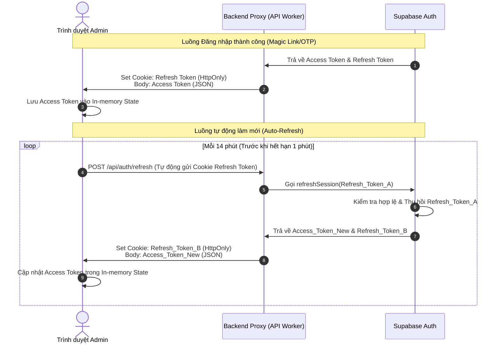
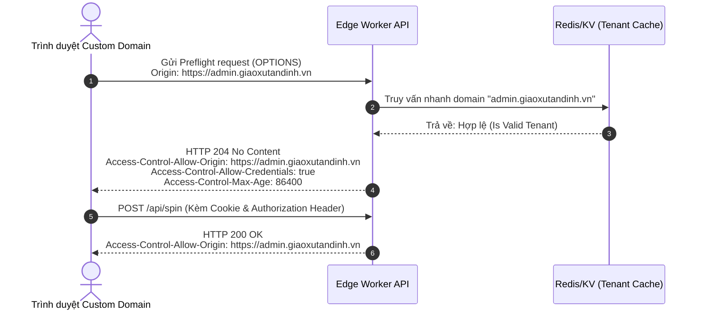

# TÀI LIỆU THIẾT KẾ: GIAO THỨC BẢO MẬT PHIÊN LÀM VIỆC ADMIN
**Dự án**: Vòng Quay Lời Chúa (Parish Wheel Platform)
**Vai trò thiết kế**: Auth & Security Architect
**Trạng thái**: Đã phê duyệt bản thảo

---

## 1. TỔNG QUAN & MÔ HÌNH MỐI ĐE DỌA (THREAT MODEL)

Hệ thống quản trị (Admin Dashboard) của Parish Wheel cho phép các Cha xứ và Ban quản lý Giáo xứ cấu hình vòng quay, nội dung Lời Chúa, âm thanh, hình ảnh và xem lịch sử quay. Do các cấu hình này có ảnh hưởng trực tiếp đến trải nghiệm của giáo dân và tính minh bạch của kết quả quay thưởng, việc bảo vệ phiên làm việc của Admin là tối quan trọng.

Chúng ta xác định các mối đe dọa chính đối với phiên làm việc Admin:
*   **Cross-Site Scripting (XSS)**: Kẻ tấn công tiêm mã độc JavaScript vào client (ví dụ qua nội dung cấu hình độc hại) để đọc trộm session token được lưu trữ ở client.
*   **Cross-Site Request Forgery (CSRF)**: Kẻ tấn công lừa trình duyệt của Admin gửi request thay đổi cấu hình lên server bằng cách tận dụng cơ chế tự động đính kèm cookie của trình duyệt.
*   **Token Leakage**: Rò rỉ token thông qua logs, Referer header hoặc lịch sử trình duyệt.
*   **Tenant Cross-talk**: Admin của giáo xứ A tìm cách chỉnh sửa vòng quay hoặc xem dữ liệu của giáo xứ B (Tấn công leo thang đặc quyền ngang).

---

## 2. QUẢN LÝ JWT TOKEN (JWT TOKEN MANAGEMENT)

Hệ thống sử dụng cơ chế xác thực dựa trên JWT (JSON Web Token) được cung cấp bởi Supabase Auth kết hợp với các tùy chỉnh bảo mật chuyên sâu.

### 2.1. Cấu trúc và Thời gian sống của Token (Lifetimes)

| Loại Token | Thời gian sống (TTL) | Cơ chế lưu trữ | Mục đích sử dụng |
| :--- | :--- | :--- | :--- |
| **Access Token** | **15 phút** (Short-lived) | Trong bộ nhớ ứng dụng (In-Memory / React State) | Gửi kèm mọi request API thông qua header `Authorization: Bearer <token>` để xác thực và phân quyền nhanh. |
| **Refresh Token** | **7 ngày** (Long-lived) | Secure HTTP-Only Cookie | Dùng để đổi lấy một Access Token mới khi Access Token cũ hết hạn mà không yêu cầu Admin phải đăng nhập lại. |

### 2.2. Luồng Cấp phát và Tự động Làm mới (Auto-Refresh & Rotation Flow)

Chúng ta áp dụng cơ chế **Refresh Token Rotation (RTR)**: Mỗi khi Refresh Token được sử dụng để lấy Access Token mới, Refresh Token cũ sẽ bị thu hồi và một Refresh Token mới được sinh ra để thay thế. Nếu phát hiện một Refresh Token đã cũ/bị thu hồi được sử dụng lại, hệ thống sẽ ngay lập tức hủy toàn bộ phiên làm việc của tài khoản đó (phòng ngừa tấn công replay).



### 2.3. Mã mẫu cấu hình Auto-Refresh tại Client (Axios Interceptors / Fetch Wrapper)

Client-side sử dụng bộ đánh chặn (Interceptor) để tự động làm mới Access Token trước khi thực hiện request, hoặc bắt lỗi `401 Unauthorized` để xếp hàng các request lỗi, thực hiện refresh và thử lại (Silent Refresh).

```typescript
// src/utils/apiClient.ts
import axios from 'axios';

let accessToken: string | null = null;
let isRefreshing = false;
let refreshSubscribers: ((token: string) => void)[] = [];

export const setInMemoryToken = (token: string | null) => {
  accessToken = token;
};

const apiClient = axios.create({
  baseURL: import.meta.env.VITE_API_URL,
  withCredentials: true, // Bắt buộc để gửi cookie chứa Refresh Token
});

// Thêm Access Token vào Header
apiClient.interceptors.request.use((config) => {
  if (accessToken) {
    config.headers.Authorization = `Bearer ${accessToken}`;
  }
  return config;
}, (error) => Promise.reject(error));

// Xử lý khi Access Token hết hạn (401)
apiClient.interceptors.response.use(
  (response) => response,
  async (error) => {
    const { config, response } = error;
    const originalRequest = config;

    if (response && response.status === 401 && !originalRequest._retry) {
      if (isRefreshing) {
        // Xếp hàng các request khác trong khi đang thực hiện refresh
        return new Promise((resolve) => {
          refreshSubscribers.push((token: string) => {
            originalRequest.headers.Authorization = `Bearer ${token}`;
            resolve(apiClient(originalRequest));
          });
        });
      }

      originalRequest._retry = true;
      isRefreshing = true;

      try {
        // Gọi API refresh (BFF sẽ đọc HttpOnly cookie)
        const refreshResponse = await axios.post(
          `${import.meta.env.VITE_API_URL}/api/auth/refresh`,
          {},
          { withCredentials: true }
        );

        const newAccessToken = refreshResponse.data.access_token;
        setInMemoryToken(newAccessToken);
        
        // Giải phóng hàng đợi
        isRefreshing = false;
        refreshSubscribers.forEach((callback) => callback(newAccessToken));
        refreshSubscribers = [];

        originalRequest.headers.Authorization = `Bearer ${newAccessToken}`;
        return apiClient(originalRequest);
      } catch (refreshError) {
        isRefreshing = false;
        refreshSubscribers = [];
        setInMemoryToken(null);
        // Chuyển hướng về trang đăng nhập
        window.location.href = '/login';
        return Promise.reject(refreshError);
      }
    }
    return Promise.reject(error);
  }
);

export default apiClient;
```

---

## 3. MÔ HÌNH LƯU TRỮ BẢO MẬT (STORAGE SECURITY MODEL)

### 3.1. So sánh chi tiết: LocalStorage vs Secure HTTP-Only Cookies

| Tiêu chí | LocalStorage | Secure HTTP-Only Cookies |
| :--- | :--- | :--- |
| **Khả năng truy cập từ JS** | Có (`window.localStorage.getItem(...)`) | **Không** (Trình duyệt chặn hoàn toàn quyền đọc từ Javascript) |
| **Nguy cơ tấn công XSS** | **Cực cao** (Nếu bị dính XSS, kẻ tấn công đọc và đánh cắp token ngay lập tức) | **Thấp** (Kẻ tấn công không thể đọc trộm token bằng JS) |
| **Nguy cơ tấn công CSRF** | Thấp (Vì JS phải tự đính kèm header Authorization, không tự động gửi) | **Cao** (Trình duyệt tự động đính kèm Cookie với mọi request cùng domain) |
| **Độ phức tạp tích hợp** | Rất đơn giản, Supabase JS client hỗ trợ mặc định | Trung bình (Cần thiết lập Backend Proxy/BFF để quản lý cookie) |
| **Hỗ trợ Custom Domain** | Dễ dàng (Lưu độc lập ở từng origin của custom domain) | Phức tạp (Cần giải pháp SameSite và quản lý CORS hợp lý) |

### 3.2. Chiến lược Bảo mật Hỗn hợp (Hybrid Security Strategy) - Khuyến nghị

Để đạt mức độ bảo mật cao nhất chống lại cả **XSS** và **CSRF**, hệ thống Parish Wheel áp dụng **Hybrid Security Strategy**:

1.  **Access Token được lưu trong bộ nhớ (In-memory)** của ứng dụng Single Page App (SPA). Khi Admin đóng tab hoặc F5, Access Token sẽ biến mất.
2.  **Refresh Token được lưu trong Secure HTTP-Only Cookie**:
    *   `HttpOnly`: JS không thể đọc -> Chống trộm token qua XSS.
    *   `Secure`: Chỉ gửi qua HTTPS -> Chống nghe trộm gói tin.
    *   `SameSite=Lax`: Trình duyệt không gửi Cookie này trong các cross-site request thông thường (chặn CSRF từ các trang web độc hại khác chuyển hướng sang), nhưng vẫn cho phép khi người dùng nhấp liên kết thông thường.
    *   `Path=/api/auth`: Chỉ gửi cookie này đến đúng các endpoint xác thực để giảm thiểu nguy cơ rò rỉ.
3.  **Cơ chế chống CSRF bổ sung cho Refresh**:
    *   Mặc dù SameSite=Lax bảo vệ phần lớn, chúng ta bắt buộc tất cả các request đến `/api/auth/refresh` và `/api/auth/logout` phải sử dụng phương thức **POST** và yêu cầu header tùy chỉnh (ví dụ: `X-Requested-With: XMLHttpRequest` hoặc chứa một Anti-CSRF token ngẫu nhiên được sinh ra trong phiên làm việc). Do trình duyệt không cho phép cross-origin requests thiết lập custom headers mà không có CORS preflight chấp thuận, cơ chế này triệt tiêu hoàn toàn nguy cơ CSRF.

### 3.3. Xử lý Cookie cho Multi-tenant Custom Domains

Vì Parish Wheel hỗ trợ các tên miền tùy chỉnh (custom domains) cho từng giáo xứ (ví dụ: `admin.giaoxutandinh.vn` bên cạnh subdomain mặc định `tandinh.vongquayloichua.com`), việc lưu trữ cookie phải tuân thủ chính sách cùng nguồn (Same-Origin Policy):

*   **Đối với Subdomains (`*.vongquayloichua.com`)**:
    Cookie được thiết lập với thuộc tính `Domain=.vongquayloichua.com`. Điều này cho phép cookie được chia sẻ an toàn giữa trang chủ, trang đăng nhập tập trung, và tất cả các subdomain của giáo xứ.
*   **Đối với Custom Domains (tên miền riêng của Giáo xứ)**:
    Do trình duyệt cấm thiết lập cookie cho một domain khác từ trang web chính, chúng ta áp dụng mô hình **BFF (Backend-For-Frontend) Proxy**:
    1. Trình duyệt truy cập `admin.giaoxutandinh.vn`.
    2. Các API login/refresh được gửi trực tiếp đến `admin.giaoxutandinh.vn/api/auth/login`.
    3. Edge Worker (Cloudflare Worker định tuyến cho tên miền đó) sẽ bắt request này, chuyển tiếp (proxy) đến Supabase Auth ở phía sau, nhận kết quả và ghi đè tiêu đề `Set-Cookie` với domain là `admin.giaoxutandinh.vn` trước khi trả về trình duyệt.
    4. Nhờ vậy, cookie Refresh Token được lưu trực tiếp trên origin của chính custom domain, tuân thủ nghiêm ngặt chính sách Same-Origin.

---

## 4. CẤU HÌNH CORS CHO MULTI-TENANT CUSTOM DOMAINS

Khi sử dụng mô hình multi-tenant với hàng trăm custom domains kết nối vào hệ thống API Edge Workers tập trung, cấu hình CORS tĩnh (Hardcoded CORS) không khả thi.

### 4.1. Giải pháp CORS Động (Dynamic CORS Origin Validation)

Chúng ta không sử dụng `Access-Control-Allow-Origin: *` vì nó không cho phép gửi kèm thông tin xác thực (`Access-Control-Allow-Credentials: true`). API Gateway / Edge Worker sẽ kiểm tra động header `Origin` của request đối chiếu với danh sách Tenant được cho phép.



### 4.2. Mã nguồn triển khai CORS động trên Cloudflare Workers (TypeScript)

```typescript
// src/cors.ts
import { createClient } from '@supabase/supabase-js';

// Khởi tạo Redis/KV để cache danh sách tenant nhằm tăng tốc độ truy vấn (<5ms)
declare const TENANT_KV: KVNamespace;

export async function handleCors(request: Request): Promise<Headers | null> {
  const origin = request.headers.get("Origin");
  if (!origin) return null;

  const parsedUrl = new URL(origin);
  const hostname = parsedUrl.hostname;

  let isAllowed = false;

  // 1. Kiểm tra nếu là domain mặc định hoặc subdomains của hệ thống
  if (hostname === "vongquayloichua.com" || hostname.endsWith(".vongquayloichua.com")) {
    isAllowed = true;
  } else {
    // 2. Tra cứu trong Cloudflare KV (đã được đồng bộ từ Supabase khi Admin đăng ký custom domain)
    const tenantInfo = await TENANT_KV.get(`domain:${hostname}`);
    if (tenantInfo) {
      const tenant = JSON.parse(tenantInfo);
      if (tenant.status === "active") {
        isAllowed = true;
      }
    }
  }

  if (isAllowed) {
    const headers = new Headers();
    headers.set("Access-Control-Allow-Origin", origin);
    headers.set("Access-Control-Allow-Credentials", "true");
    headers.set("Access-Control-Allow-Methods", "GET, POST, PUT, DELETE, OPTIONS");
    headers.set("Access-Control-Allow-Headers", "Content-Type, Authorization, X-Client-Fingerprint, X-Requested-With");
    headers.set("Access-Control-Max-Age", "86400"); // Cache preflight 24 giờ để giảm tải
    return headers;
  }

  return null; // Không trả về CORS headers -> Trình duyệt tự động chặn request
}

export function handleOptionsRequest(request: Request, corsHeaders: Headers | null): Response {
  if (!corsHeaders) {
    return new Response("CORS Origin Not Allowed", { status: 403 });
  }
  return new Response(null, {
    status: 204,
    headers: corsHeaders,
  });
}
```

---

## 5. XÁC THỰC VÀ PHÂN QUYỀN Ở BACKEND (AUTHORIZATION HEADERS VERIFICATION)

Mọi request từ Admin Dashboard gửi tới backend API (Supabase Edge Functions / Cloudflare Workers) bắt buộc phải đính kèm Access Token trong header `Authorization: Bearer <token>`.

### 5.1. Quy trình Xác thực & Cách ly dữ liệu Tenant (Tenant Isolation)

1.  **Trích xuất Token**: Đọc header `Authorization` và tách chuỗi JWT.
2.  **Xác thực chữ ký JWT**: Giải mã và kiểm tra tính toàn vẹn của token bằng cách sử dụng Public Key của nhà cung cấp danh tính (Supabase Auth JWT Secret).
3.  **Kiểm tra hạn dùng (Expiration)**: Đảm bảo thời gian hiện tại nằm trước trường `exp` trong token payload.
4.  **Kiểm tra Audience & Role**: Xác minh claim `aud` là `authenticated` và `role` là `admin` hoặc vai trò được phân quyền thao tác.
5.  **Cách ly cấp cơ sở dữ liệu (Database-level Isolation)**:
    Thay vì sử dụng tài khoản Service Role (`supabase_admin_key`) có toàn quyền để truy vấn, backend Worker sẽ khởi tạo một instance Supabase Client mới **bằng chính JWT của Admin**.
    Mọi câu lệnh SQL/REST API gửi đến cơ sở dữ liệu sẽ chạy dưới danh tính của Admin đó, giúp kích hoạt tự động cơ chế **Row Level Security (RLS)** trên PostgreSQL.

### 5.2. Mã nguồn mẫu kiểm tra Authorization Header & Khởi tạo Database Scoped (TypeScript / Deno)

```typescript
// functions/api/admin-handler.ts
import { createClient } from 'https://esm.sh/@supabase/supabase-js@2';
import * as jose from 'https://esm.sh/jose@4';

const SUPABASE_URL = Deno.env.get("SUPABASE_URL")!;
const SUPABASE_ANON_KEY = Deno.env.get("SUPABASE_ANON_KEY")!;
const SUPABASE_JWT_SECRET = Deno.env.get("SUPABASE_JWT_SECRET")!;

interface AdminPayload {
  userId: string;
  email: string;
  role: string;
}

// Hàm xác thực token JWT gửi lên từ client
async function authenticateAdmin(req: Request): Promise<AdminPayload> {
  const authHeader = req.headers.get("Authorization");
  if (!authHeader || !authHeader.startsWith("Bearer ")) {
    throw new Error("Missing or invalid Authorization header");
  }

  const token = authHeader.split(" ")[1];

  try {
    // Xác thực chữ ký JWT bằng Secret Key của Supabase Auth
    const secret = new TextEncoder().encode(SUPABASE_JWT_SECRET);
    const { payload } = await jose.jwtVerify(token, secret, {
      audience: "authenticated",
    });

    // Trích xuất vai trò từ metadata
    const userRole = payload.role; // Vai trò mặc định của Supabase Auth
    const appRole = (payload.app_metadata as any)?.role || (payload.user_metadata as any)?.role;

    if (userRole !== "authenticated" || appRole !== "admin") {
      throw new Error("Forbidden: Insufficient privileges");
    }

    return {
      userId: payload.sub!,
      email: payload.email as string,
      role: appRole,
    };
  } catch (error) {
    console.error("JWT Verification failed:", error);
    throw new Error("Unauthorized: Invalid session token");
  }
}

// API Handler xử lý cập nhật cấu hình vòng quay
export async function handleUpdateWheel(req: Request): Promise<Response> {
  // 1. Xác thực Admin Session
  let admin: AdminPayload;
  try {
    admin = await authenticateAdmin(req);
  } catch (authError: any) {
    return new Response(JSON.stringify({ error: authError.message }), {
      status: authError.message.includes("Forbidden") ? 403 : 401,
      headers: { "Content-Type": "application/json" }
    });
  }

  // 2. Khởi tạo Supabase Client có gắn kèm token của Admin
  const authHeader = req.headers.get("Authorization")!;
  const adminToken = authHeader.split(" ")[1];
  
  const userScopedSupabase = createClient(SUPABASE_URL, SUPABASE_ANON_KEY, {
    global: {
      headers: {
        Authorization: `Bearer ${adminToken}`, // Áp dụng token để kích hoạt RLS
      },
    },
  });

  try {
    const { wheelId, configData } = await req.json();

    // 3. Thực hiện cập nhật. 
    // Nhờ RLS, PostgreSQL sẽ tự động kiểm tra xem admin.userId có quyền sở hữu vòng quay này không.
    // Nếu không sở hữu, câu lệnh UPDATE sẽ trả về 0 bản ghi thay đổi hoặc báo lỗi RLS.
    const { data, error } = await userScopedSupabase
      .from('wheels')
      .update({ config: configData })
      .eq('id', wheelId)
      .select();

    if (error) throw error;
    if (!data || data.length === 0) {
      return new Response(JSON.stringify({ error: "Wheel not found or you do not have permission." }), {
        status: 404,
        headers: { "Content-Type": "application/json" }
      });
    }

    return new Response(JSON.stringify({ success: true, data: data[0] }), {
      status: 200,
      headers: { "Content-Type": "application/json" }
    });
  } catch (dbError: any) {
    return new Response(JSON.stringify({ error: dbError.message }), {
      status: 500,
      headers: { "Content-Type": "application/json" }
    });
  }
}
```

---

## 6. HƯỚNG DẪN KIỂM TRA & GIÁM SÁT AN TOÀN (SECURITY AUDIT CHECKLIST)

1.  [ ] **Chặn rò rỉ JWT qua Referer**: Thiết lập header `Referrer-Policy: strict-origin-when-cross-origin` trên toàn trang web Admin để tránh gửi kèm token trong query strings (nếu có) khi chuyển hướng sang trang ngoài.
2.  [ ] **Thiết lập Content Security Policy (CSP)**: Chỉ cho phép kết nối API đến các domain được định danh và các tài nguyên tĩnh tin cậy, giảm thiểu 99% khả năng khai thác XSS để gửi trộm token ra ngoài.
3.  [ ] **Giám sát số lần quay vòng/Refresh**: Cảnh báo tự động trên hệ thống giám sát (Sentry/Logflare) nếu phát hiện tần suất gọi API `/api/auth/refresh` bất thường từ một IP (dấu hiệu của brute-force hoặc rò rỉ token).
4.  [ ] **Bảo vệ chống replay trong Database**: Bảng `spin_history` lưu vết thông tin IP và Fingerprint kèm chữ ký kết quả. Khi phát hiện chữ ký sai lệch hoặc có sự thay đổi góc dừng do client tự tính toán, lập tức đánh dấu và vô hiệu hóa lịch sử.
