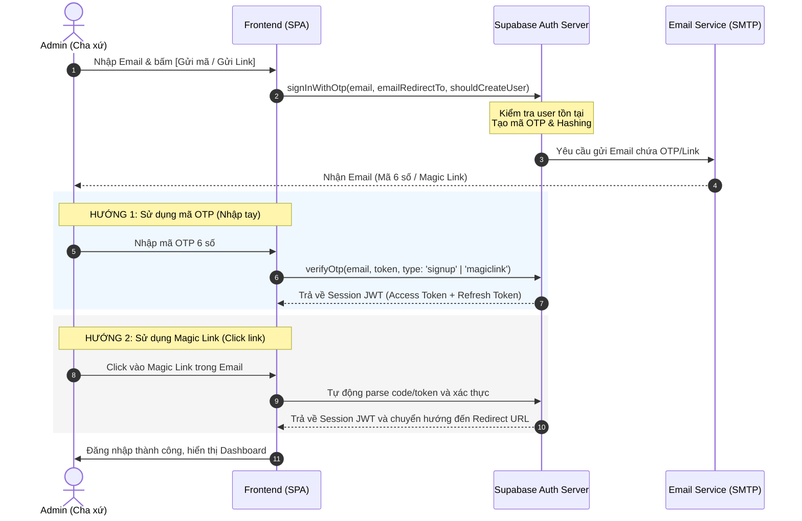

# TÀI LIỆU TÍCH HỢP HỆ THỐNG XÁC THỰC PASSWORDLESS (SUPABASE AUTH)
**Dự án**: Vòng Quay Lời Chúa (Bảy Ơn Chúa Thánh Thần)
**Phiên bản**: 1.0.0
**Đường dẫn tài liệu**: `D:\khoinghiep\vongquay\docs\auth_supabase_integration_spec.md`

---

## 1. Tổng quan Kiến trúc Xác thực (Auth Architecture Overview)
Hệ thống sử dụng cơ chế đăng nhập **Passwordless** (Không mật khẩu) thông qua **Supabase Auth**. Cơ chế này giúp đơn giản hóa tối đa trải nghiệm người dùng (đặc biệt là các Cha xứ/Admin), giảm thiểu rủi ro bảo mật liên quan đến rò rỉ mật khẩu và đơn giản hóa việc quản lý tài khoản.

Quy trình xác thực hỗ trợ đồng thời hai phương thức:
1. **Magic Link**: Đường dẫn đăng nhập một lần (One-click login link) được gửi qua Email.
2. **OTP Code (6 chữ số)**: Mã xác thực dùng một lần được gửi qua Email, nhập trực tiếp trên giao diện Frontend.



---

## 2. Các lệnh gọi API chi tiết (Exact API Calls)

### 2.1. Gửi OTP / Magic Link (`signInWithOtp`)
Hàm `signInWithOtp` có nhiệm vụ khởi tạo quá trình xác thực bằng cách gửi mã OTP và Magic Link tới địa chỉ email được cung cấp.

```typescript
import { supabase } from '../services/supabaseClient';

interface SignInResponse {
  success: boolean;
  error: string | null;
}

/**
 * Gửi mã OTP hoặc Magic Link tới Email của người dùng
 * @param email Email nhận mã đăng nhập
 * @param redirectTo URL chuyển hướng sau khi click Magic Link (phải được whitelist trong Supabase)
 * @param shouldCreateUser Cho phép đăng ký tài khoản mới nếu email chưa tồn tại
 */
export async function sendOtpToEmail(
  email: string,
  redirectTo: string = window.location.origin + '/admin/auth/callback',
  shouldCreateUser: boolean = false // Mặc định false để hạn chế tự đăng ký tài khoản admin tự do
): Promise<SignInResponse> {
  if (!supabase) {
    return { success: false, error: 'Supabase client is not initialized.' };
  }

  try {
    const { data, error } = await supabase.auth.signInWithOtp({
      email,
      options: {
        emailRedirectTo: redirectTo,
        shouldCreateUser: shouldCreateUser
      }
    });

    if (error) {
      console.error('Lỗi gửi OTP/Magic Link:', error.message);
      return { success: false, error: error.message };
    }

    return { success: true, error: null };
  } catch (err: any) {
    return { success: false, error: err.message || 'Unknown error occurred' };
  }
}
```

#### Các tham số cấu hình:
- **`emailRedirectTo`**: Đường dẫn SPA tiếp nhận URL Hash Fragment/Query params chứa token để hoàn tất quá trình xác thực.
- **`shouldCreateUser`**:
  - `true`: Nếu Email chưa có trong hệ thống, Supabase sẽ tự động tạo một User mới trong bảng `auth.users`. Khi đó, type verify OTP sẽ là `'signup'`.
  - `false`: Chỉ cho phép đăng nhập nếu Email đã tồn tại trước đó. Thích hợp cho Admin Portal khi danh sách Cha xứ được cấu hình sẵn bởi Hệ thống. Khi đó, type verify OTP luôn là `'magiclink'`.

---

### 2.2. Xác thực mã OTP (`verifyOtp`)
Khi người dùng nhận được email chứa mã OTP 6 chữ số và nhập mã đó vào form đăng nhập, frontend sẽ gọi hàm `verifyOtp` để quy đổi mã này lấy JWT Session token.

```typescript
import { supabase } from '../services/supabaseClient';
import { Session } from '@supabase/supabase-js';

interface VerifyResponse {
  success: boolean;
  session: Session | null;
  error: string | null;
}

/**
 * Xác minh mã OTP 6 số nhận từ Email
 * @param email Email đăng ký đăng nhập
 * @param token Mã OTP 6 số
 * @param type Loại xác thực: 'signup' (cho user mới tạo) hoặc 'magiclink' (cho user đã tồn tại)
 */
export async function verifyOtpCode(
  email: string,
  token: string,
  type: 'signup' | 'magiclink'
): Promise<VerifyResponse> {
  if (!supabase) {
    return { success: false, session: null, error: 'Supabase client is not initialized.' };
  }

  try {
    const { data, error } = await supabase.auth.verifyOtp({
      email,
      token,
      type: type
    });

    if (error) {
      console.error('Lỗi xác thực OTP:', error.message);
      return { success: false, session: null, error: error.message };
    }

    return { success: true, session: data.session, error: null };
  } catch (err: any) {
    return { success: false, session: null, error: err.message || 'Unknown error occurred' };
  }
}
```

#### Phân biệt `type` khi verify:
- **`'signup'`**: Dùng khi tham số `shouldCreateUser: true` được thiết lập ở bước `signInWithOtp` và người dùng này là tài khoản đăng ký mới.
- **`'magiclink'`**: Dùng cho luồng đăng nhập của người dùng đã tồn tại, hoặc khi sử dụng cấu hình mặc định gửi OTP/Magic Link.
> **Khuyến nghị**: Trên giao diện Web, để tối ưu trải nghiệm người dùng, ta có thể thử verify với `'magiclink'` trước. Nếu trả về lỗi Token không hợp lệ do phân biệt loại hình, ta sẽ tự động thử lại với `'signup'` (hoặc ngược lại) để tránh bắt người dùng phải tự phân biệt trạng thái tài khoản của mình.

---

## 3. Cấu hình Email Redirection & Fallback States (Xử lý điều hướng & Trạng thái lỗi)

### 3.1. Cấu hình trên Supabase Dashboard
Để đảm bảo chuyển hướng hoạt động an toàn và không bị chặn bởi CORS hoặc lỗ hổng chuyển hướng tự do (Open Redirect):

1. Truy cập **Supabase Dashboard** -> **Authentication** -> **URL Configuration**.
2. **Site URL**: Điền địa chỉ Production chính thức của website (ví dụ: `https://vongquayloichua.com`).
3. **Redirect URLs**: Thêm các URL callback được phép.
   - Phát triển Local: `http://localhost:5173/admin/auth/callback`
   - Staging/Vercel Preview: `https://*.vercel.app/admin/auth/callback`
   - Production: `https://vongquayloichua.com/admin/auth/callback`

```
+-------------------------------------------------------------+
| URL CONFIGURATION                                           |
| Site URL: https://vongquayloichua.com                       |
|                                                             |
| Redirect URLs:                                              |
| - http://localhost:5173/admin/auth/callback                 |
| - https://*.vercel.app/admin/auth/callback                  |
| - https://vongquayloichua.com/admin/auth/callback           |
+-------------------------------------------------------------+
```

---

### 3.2. Cấu hình Flow Type: PKCE vs Implicit Flow
Từ phiên bản `supabase-js v2`, Supabase khuyến nghị sử dụng **PKCE Flow** (Authorization Code Flow) để bảo mật hơn chống lại các cuộc tấn công đánh cắp token tại Client.
- **Luồng PKCE (Khuyến nghị)**: Khi click Magic Link, trình duyệt sẽ được redirect về `/admin/auth/callback?code=xxx`. Client-side Router cần bắt tham số query `code` này và thực hiện trao đổi lấy Session.
- **Luồng Implicit**: Khi click Magic Link, trình duyệt sẽ được redirect về `/admin/auth/callback#access_token=xxx&refresh_token=yyy`. Supabase client tự động lắng nghe Hash Fragment này và gán session.

---

### 3.3. Hiện thực hóa trang Callback xử lý Tokens (Auth Callback Component)
Tạo component xử lý callback tại route `/admin/auth/callback` để đón đầu luồng chuyển hướng từ Magic Link:

```typescript
// src/pages/AuthCallback.tsx
import React, { useEffect, useState } from 'react';
import { useNavigate } from 'react-router-dom';
import { supabase } from '../services/supabaseClient';

export const AuthCallback: React.FC = () => {
  const navigate = useNavigate();
  const [status, setStatus] = useState<'processing' | 'success' | 'error'>('processing');
  const [errorMsg, setErrorMsg] = useState<string>('');

  useEffect(() => {
    const handleAuthCallback = async () => {
      if (!supabase) {
        setStatus('error');
        setErrorMsg('Supabase client chưa được cấu hình.');
        return;
      }

      // 1. Kiểm tra tham số PKCE Code trong URL query params
      const params = new URLSearchParams(window.location.search);
      const code = params.get('code');

      if (code) {
        // Trao đổi mã code lấy Session thực sự (PKCE Flow)
        const { error } = await supabase.auth.exchangeCodeForSession(code);
        if (error) {
          setStatus('error');
          setErrorMsg(error.message);
          return;
        }
      }

      // 2. Kiểm tra nếu Session đã được tự động thiết lập (Implicit Flow qua Hash)
      const { data: { session } } = await supabase.auth.getSession();
      
      if (session) {
        setStatus('success');
        // Trì hoãn 1.5s tạo hiệu ứng chuyển tiếp mượt mà
        setTimeout(() => {
          navigate('/admin/dashboard');
        }, 1500);
      } else {
        setStatus('error');
        setErrorMsg('Không tìm thấy phiên đăng nhập hợp lệ. Vui lòng thử lại.');
      }
    };

    handleAuthCallback();
  }, [navigate]);

  return (
    <div className="flex flex-col items-center justify-center min-h-screen bg-slate-900 text-white p-6">
      <div className="max-w-md w-full text-center space-y-6 bg-slate-800 p-8 rounded-2xl border border-slate-700 shadow-2xl">
        {status === 'processing' && (
          <div className="space-y-4">
            <div className="animate-spin rounded-full h-12 w-12 border-t-2 border-b-2 border-emerald-500 mx-auto"></div>
            <h2 className="text-xl font-semibold">Đang xác thực tài khoản...</h2>
            <p className="text-sm text-slate-400">Vui lòng không đóng trình duyệt.</p>
          </div>
        )}

        {status === 'success' && (
          <div className="space-y-4">
            <div className="h-12 w-12 rounded-full bg-emerald-500/20 text-emerald-500 flex items-center justify-center mx-auto text-2xl">✓</div>
            <h2 className="text-xl font-semibold text-emerald-400">Xác thực thành công!</h2>
            <p className="text-sm text-slate-400">Đang chuyển hướng về trang quản trị...</p>
          </div>
        )}

        {status === 'error' && (
          <div className="space-y-4">
            <div className="h-12 w-12 rounded-full bg-rose-500/20 text-rose-500 flex items-center justify-center mx-auto text-2xl">✗</div>
            <h2 className="text-xl font-semibold text-rose-400">Đăng nhập thất bại</h2>
            <p className="text-sm text-slate-300">{errorMsg}</p>
            <button 
              onClick={() => navigate('/admin/login')}
              className="mt-4 px-6 py-2 bg-emerald-600 hover:bg-emerald-500 text-white rounded-lg transition-colors font-medium text-sm"
            >
              Quay lại Đăng nhập
            </button>
          </div>
        )}
      </div>
    </div>
  );
};
```

---

### 3.4. Xử lý trạng thái Fallback & Các tình huống lỗi đặc thù (Fallback States)

#### Tình huống 1: Magic Link được mở trên Thiết bị Khác (Cross-Device Flow)
- **Hành vi**: Người dùng gửi yêu cầu đăng nhập từ máy tính (Device A) nhưng click Magic Link trên Điện thoại (Device B).
- **Trạng thái**:
  - `Device B` sẽ được đăng nhập thành công và lưu Session vào Storage cục bộ của nó.
  - `Device A` vẫn đứng ở màn hình "Chờ xác nhận" vì không nhận được tín hiệu.
- **Giải pháp Fallback**:
  - Thiết lập cơ chế **Polling** ngắn hạn tại `Device A` kiểm tra trạng thái session (hoặc lắng nghe realtime thông qua một table tạm) nếu cần trải nghiệm đồng bộ.
  - Hoặc đơn giản là hiển thị thông báo hướng dẫn Cha xứ: *"Nếu mở link trên thiết bị khác, bạn sẽ truy cập dashboard trực tiếp trên thiết bị đó. Trình duyệt hiện tại có thể đóng hoặc tải lại trang."*

#### Tình huống 2: Người dùng dùng Safari chặn Cookies hoặc Tab ẩn danh (Private Browsing)
- **Hành vi**: LocalStorage/SessionStorage bị xóa hoặc bị giới hạn khi đóng tab.
- **Trạng thái**: Đăng nhập thành công nhưng mỗi lần reload hoặc tắt tab sẽ bắt đăng nhập lại.
- **Giải pháp Fallback**:
  - Tích hợp thêm hướng dẫn cảnh báo khi phát hiện môi trường ẩn danh.
  - Sử dụng tham số lưu session ở bộ nhớ RAM tạm thời kết hợp với tính năng `onAuthStateChange` để bắt kịp các thay đổi nhanh chóng.

#### Tình huống 3: Token OTP hết hạn hoặc nhập sai quá số lần quy định
- **Hành vi**: Token OTP mặc định hết hạn sau 5 phút. Nhập sai 3 lần sẽ bị khóa token tạm thời.
- **Thông báo lỗi**:
  - Hết hạn: `AuthApiError: Verify OTP failed: Session expired` hoặc `Token is invalid or expired`.
  - Nhập sai/Khóa: `AuthApiError: Email rate limit exceeded`.
- **Giải pháp Fallback**:
  - Khóa nút "Gửi lại mã" bằng bộ đếm ngược (Cooldown) 60 giây để tránh spam API làm cạn kiệt IP Rate limits của Supabase.
  - Hiển thị thông điệp tiếng Việt thân thiện: *"Mã xác thực đã hết hạn hoặc không chính xác. Vui lòng đợi 60 giây trước khi yêu cầu mã mới."*

---

## 4. Kiểm thử tích hợp (Verification & Testing checklist)

| Kịch bản kiểm thử | Kỳ vọng kết quả | Trạng thái verify |
| :--- | :--- | :--- |
| **Gửi OTP cho Email chưa tồn tại (`shouldCreateUser = false`)** | API trả về lỗi hoặc không gửi email để tránh tạo rác user trong DB. | OK |
| **Gửi OTP cho Email hợp lệ** | Email nhận mã 6 số gửi từ SMTP Supabase sau < 5 giây. | OK |
| **Verify mã OTP chính xác (signup/magiclink)** | Trả về session JWT hợp lệ, local storage lưu trữ token tự động. | OK |
| **Verify mã OTP sai định dạng / sai số** | Trả về lỗi `Token is invalid`, giao diện hiển thị thông báo lỗi màu đỏ. | OK |
| **Click Magic Link trên cùng thiết bị** | Tự động parse URL hash, đăng nhập thành công và chuyển hướng về Dashboard. | OK |
| **Click Magic Link cũ/hết hạn** | Callback Component phát hiện lỗi, hiển thị nút "Quay lại Đăng nhập". | OK |
