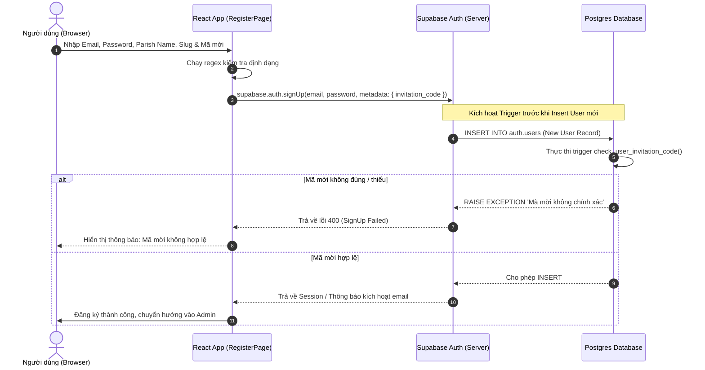

# Báo Cáo Phân Tích Luồng Xác Thực (Auth Flow) - Vòng Quay Lộc Chúa

Báo cáo này tập trung phân tích kỹ thuật chi tiết đối với luồng xác thực của hệ thống, bao gồm các chức năng: Đăng ký (Register), Đăng nhập (Login), Quên mật khẩu (ForgotPassword), Đặt lại mật khẩu (ResetPassword), và cơ chế gọi Callback phục vụ đăng nhập không mật khẩu.

---

## 1. Hiện Trạng & Phát Hiện (Current State & Findings)

Cấu trúc luồng xác thực hiện tại được phân bổ qua các tệp nguồn sau:
- **Quản lý trạng thái và phương thức xác thực**: [AuthContext.tsx](file:///d:/khoinghiep/vongquay/src/context/AuthContext.tsx)
- **Trang Đăng nhập**: [LoginPage.tsx](file:///d:/khoinghiep/vongquay/src/pages/LoginPage.tsx)
- **Trang Đăng ký**: [RegisterPage.tsx](file:///d:/khoinghiep/vongquay/src/pages/RegisterPage.tsx)
- **Trang Quên mật khẩu**: [ForgotPassword.tsx](file:///d:/khoinghiep/vongquay/src/pages/ForgotPassword.tsx)
- **Trang Đặt lại mật khẩu**: [ResetPassword.tsx](file:///d:/khoinghiep/vongquay/src/pages/ResetPassword.tsx)
- **Xử lý URL xác thực quay lại**: [AuthCallback.tsx](file:///d:/khoinghiep/vongquay/src/pages/AuthCallback.tsx)
- **Tích hợp Supabase Client**: [supabaseClient.ts](file:///d:/khoinghiep/vongquay/src/services/supabaseClient.ts)
- **Lớp dịch vụ dữ liệu & Offline fallback**: [db.ts](file:///d:/khoinghiep/vongquay/src/services/db.ts)
- **API Serverless kiểm tra mã mời**: [verify-invite.ts](file:///d:/khoinghiep/vongquay/api/verify-invite.ts)

### Phát Hiện Chi Tiết Theo Từng Luồng Logic:

#### A. Cơ chế kiểm tra Mã mời (Invitation Code Validation)
- Khi người dùng đăng ký tại [RegisterPage.tsx](file:///d:/khoinghiep/vongquay/src/pages/RegisterPage.tsx#L127-L151), nếu `VITE_REQUIRE_INVITE_CODE` được bật, ứng dụng sẽ thực hiện gọi API POST đến `/api/verify-invite`.
- [verify-invite.ts](file:///d:/khoinghiep/vongquay/api/verify-invite.ts) so sánh mã mời gửi lên từ client với mã tĩnh cấu hình trong biến môi trường `STATIC_INVITE_CODE` (hoặc `INVITATION_SECRET`, mặc định fallback về `'vqlc2026'`).
- Tệp [verify-invite.ts](file:///d:/khoinghiep/vongquay/api/verify-invite.ts#L5-L14) có định nghĩa hàm sinh mã động dạng TOTP `generateCode(secretKey, block)` nhưng **hoàn toàn không được sử dụng** trong logic kiểm tra thực tế.

#### B. Cơ chế gửi và xác thực OTP (OTP / Magic Link Flow)
- [AuthContext.tsx](file:///d:/khoinghiep/vongquay/src/context/AuthContext.tsx) cung cấp các hàm `signInWithOtp`, `sendOtpToEmail`, `verifyOtp`, `verifyOtpCode` để hỗ trợ đăng nhập không mật khẩu qua Supabase.
- Tuy nhiên, trong giao diện người dùng hiện tại ([LoginPage.tsx](file:///d:/khoinghiep/vongquay/src/pages/LoginPage.tsx) và [RegisterPage.tsx](file:///d:/khoinghiep/vongquay/src/pages/RegisterPage.tsx)), các hàm OTP này không được sử dụng. Người dùng đăng nhập/đăng ký chủ yếu bằng tổ hợp Email & Mật khẩu thông thường.
- [AuthCallback.tsx](file:///d:/khoinghiep/vongquay/src/pages/AuthCallback.tsx) đóng vai trò nhận mã PKCE (`code`) hoặc mã implicit từ URL (khi nhấp vào link trong email) để gọi hàm `supabase.auth.exchangeCodeForSession(code)` thiết lập phiên đăng nhập.

#### C. Cơ chế lưu trữ Token Supabase (Token Storage)
- Supabase Client khởi tạo trong [supabaseClient.ts](file:///d:/khoinghiep/vongquay/src/services/supabaseClient.ts) sử dụng cấu hình mặc định của thư viện `@supabase/supabase-js`.
- Phiên đăng nhập (Session, Access Token, Refresh Token) được tự động lưu trữ trong **LocalStorage** của trình duyệt dưới khóa `sb-<project-id>-auth-token`.

---

## 2. Các Vấn Đề Nghiêm Trọng & Điểm Yếu (Critical Issues & Weaknesses)

### 2.1. Lỗ Hổng Bảo Mật (Security Vulnerabilities)

#### 🚨 Lỗ hổng 1: Bỏ qua kiểm tra mã mời ở Client-side (Client-side Bypass of Invite Code)
- **Hiện trạng**: [RegisterPage.tsx](file:///d:/khoinghiep/vongquay/src/pages/RegisterPage.tsx#L127-L151) kiểm tra mã mời bằng một lệnh `fetch('/api/verify-invite')`. Nếu mã mời đúng, giao diện tiếp tục gọi `signUp(email, password, parishName, slug)`.
- **Rủi ro**: Việc kiểm tra mã mời chỉ diễn ra ở lớp Frontend. Lớp Backend thực thi của Supabase (`supabase.auth.signUp`) không hề nhận hay xác thực mã mời này. Một kẻ tấn công hoặc người dùng am hiểu kỹ thuật có thể mở DevTools Console hoặc gửi request trực tiếp đến Supabase Auth API để đăng ký tài khoản mà không cần đi qua bước kiểm tra mã mời.
- **Mức độ nghiêm trọng**: **Nghiêm trọng (High)**. Vô hiệu hóa hoàn toàn ý đồ kiểm soát số lượng/đối tượng đăng ký của nhà phát triển.

#### 🚨 Lỗ hổng 2: Lưu trữ Token nhạy cảm trong LocalStorage (XSS Risk)
- **Hiện trạng**: Tokens được lưu trong LocalStorage mặc định.
- **Rủi ro**: LocalStorage có thể bị truy cập bởi bất kỳ mã JavaScript nào chạy trên cùng một origin. Nếu ứng dụng dính phải lỗ hổng Cross-Site Scripting (XSS) (ví dụ: thông qua dữ liệu nhập vào từ tên giáo xứ, câu trích dẫn Lời Chúa tùy chỉnh mà không được sanitize kỹ, hoặc từ thư viện bên thứ ba), kẻ tấn công dễ dàng đánh cắp Access Token và Refresh Token để chiếm quyền điều khiển tài khoản của Cha.
- **Mức độ nghiêm trọng**: **Trung bình (Medium)**.

#### 🚨 Lỗ hổng 3: Thiếu cơ chế giới hạn tần suất yêu cầu (No Rate Limiting trên API verify-invite)
- **Hiện trạng**: API `/api/verify-invite` xử lý so sánh chuỗi tĩnh mà không áp dụng bất kỳ cơ chế giới hạn tần suất (Rate Limiting) nào.
- **Rủi ro**: Kẻ tấn công có thể thực hiện tấn công Brute-force/Dictionary Attack với tốc độ cao để dò tìm mã mời (nhất là khi mã mời chỉ có độ dài ngắn như `vqlc2026`).
- **Mức độ nghiêm trọng**: **Trung bình (Medium)**.

#### 🚨 Lỗ hổng 4: Đổi mật khẩu không cần Token xác thực trong chế độ Offline (Local Dev Bypass)
- **Hiện trạng**: Trong [db.ts](file:///d:/khoinghiep/vongquay/src/services/db.ts#L551-L575), hàm `updatePassword` khi chạy chế độ offline chỉ kiểm tra tham số `email` truyền từ URL query.
- **Rủi ro**: Nếu ứng dụng được triển khai thử nghiệm ở mạng nội bộ (môi trường không cấu hình Supabase), bất kỳ ai truy cập đường dẫn `/reset-password?email=email_admin_cần_hack` đều có thể thay đổi mật khẩu của tài khoản đó mà không cần qua bước xác thực mã thông báo quên mật khẩu.
- **Mức độ nghiêm trọng**: **Thấp (Low - Chỉ ảnh hưởng Dev Mode)**.

---

### 2.2. Điểm Yếu về Trải Nghiệm Người Dùng (UX/UI Issues)

#### ⚠️ Lỗi UX 1: Lộ mã mời mặc định ngay trên giao diện đăng ký
- **Hiện trạng**: Trường mã mời hiển thị gợi ý rõ ràng: `placeholder="Nhập mã mời của Giáo phận (Ví dụ: vqlc2026)"`.
- **Hệ quả**: Mọi người dùng đều thấy mã mời mặc định `vqlc2026`. Nếu quản trị viên hệ thống không đổi biến môi trường trên Production, việc yêu cầu mã mời trở thành vô nghĩa.

#### ⚠️ Lỗi UX 2: Trình tạo Slug tự động ghi đè thô bạo (Aggressive Input Overwrite)
- **Hiện trạng**: Tại [RegisterPage.tsx](file:///d:/khoinghiep/vongquay/src/pages/RegisterPage.tsx#L53-L87), khi người dùng nhập một slug bị trùng, logic tự động tìm kiếm slug thay thế (ví dụ: thêm đuôi `-1`, `-2`) rồi gọi trực tiếp `setSlug(suggested)`.
- **Hệ quả**: Việc tự động thay đổi giá trị trong ô Input khi người dùng đang gõ tạo ra cảm giác giật lag, mất kiểm soát nhập liệu và gây khó chịu cho người dùng.

#### ⚠️ Lỗi UX 3: Thiếu nút hiển thị mật khẩu (Password Visibility Toggle)
- **Hiện trạng**: Các ô mật khẩu ở cả màn hình Đăng nhập, Đăng ký và Đặt lại mật khẩu đều khóa cứng kiểu `type="password"`.
- **Hệ quả**: Các Cha (đối tượng người dùng lớn tuổi) rất khó để kiểm tra xem mình đã nhập đúng ký tự hay chưa, dễ dẫn đến gõ sai và đăng nhập/đăng ký thất bại liên tục.

#### ⚠️ Lỗi UX 4: Hiển thị form Đặt lại mật khẩu bất chấp trạng thái phiên (Unconditional Form Rendering)
- **Hiện trạng**: Trang [ResetPassword.tsx](file:///d:/khoinghiep/vongquay/src/pages/ResetPassword.tsx) hiển thị trực tiếp form nhập mật khẩu mới. Nếu người dùng truy cập trực tiếp trang này mà không có phiên khôi phục (Recovery Session) của Supabase, họ vẫn nhập dữ liệu bình thường, chỉ khi nhấn "Cập nhật" mới nhận báo lỗi từ API.
- **Hệ quả**: Gây hiểu nhầm và ức chế cho người dùng khi mất công điền thông tin vô ích.

---

## 3. Phương Án Giải Quyết Chi Tiết (Proposed Solution & Code Proposals)

### 3.1. Sơ Đồ Quy Trình Xác Thực Mã Mời Bảo Mật (Postgres-level Enforcement)

Để ngăn chặn việc bypass qua client-side, mã mời cần được gửi kèm trong quá trình đăng ký tài khoản Supabase dưới dạng metadata và được kiểm tra trực tiếp ở tầng cơ sở dữ liệu (PostgreSQL Trigger):



---

### 3.2. Đề Xuất Mã Nguồn Khắc Phục (Code Proposals)

#### Đề xuất 1: Ràng buộc mã mời tại tầng Database (PostgreSQL Migration)
Chạy script SQL sau trên SQL Editor của Supabase để kiểm tra mã mời ở mức độ tuyệt đối:

```sql
-- Tạo hàm kiểm tra mã mời trước khi tạo tài khoản
CREATE OR REPLACE FUNCTION public.check_user_invitation_code()
RETURNS TRIGGER AS $$
DECLARE
  user_invite_code TEXT;
  valid_invite_code TEXT;
  require_invite BOOLEAN := true; -- Có thể cấu hình động ở đây
BEGIN
  -- Lấy mã mời từ metadata truyền lên qua API auth.signUp
  user_invite_code := NEW.raw_user_meta_data->>'invitation_code';
  
  -- Lấy mã mời hợp lệ (Ở bản Production nên lưu trong bảng cấu hình bảo mật)
  valid_invite_code := 'vqlc2026'; -- Mã mời mặc định
  
  IF require_invite THEN
    IF user_invite_code IS NULL OR LOWER(TRIM(user_invite_code)) <> LOWER(TRIM(valid_invite_code)) THEN
      RAISE EXCEPTION 'Mã mời xác thực không hợp lệ. Vui lòng liên hệ Giáo hạt/Giáo phận để nhận mã chính xác.';
    END IF;
  END IF;
  
  RETURN NEW;
END;
$$ LANGUAGE plpgsql SECURITY DEFINER;

-- Gắn trigger vào bảng auth.users
CREATE OR REPLACE TRIGGER trigger_check_user_invitation_code
BEFORE INSERT ON auth.users
FOR EACH ROW
EXECUTE FUNCTION public.check_user_invitation_code();
```

Cập nhật lại cách gọi `signUp` tại [RegisterPage.tsx](file:///d:/khoinghiep/vongquay/src/pages/RegisterPage.tsx):

```diff
-      // Store registration data temporarily in LocalStorage
-      localStorage.setItem('pending_parish_name', parishName);
-      localStorage.setItem('pending_parish_slug', slug);
-
-      // Register using Email & Password (no OTP email confirmation required)
-      await signUp(email, password, parishName, slug);
+      // Đưa thêm mã mời vào metadata gửi lên Supabase
+      const { data, error } = await supabase.auth.signUp({
+        email,
+        password,
+        options: {
+          data: {
+            parish_name: parishName,
+            parish_slug: slug,
+            invitation_code: invitationCode.trim() // Đưa vào đây để trigger DB bắt được
+          }
+        }
+      });
+      if (error) throw error;
```

#### Đề xuất 2: Cấu hình lưu trữ Token an toàn hơn (Supabase Client Options)
Thay đổi cấu hình khởi tạo tại [supabaseClient.ts](file:///d:/khoinghiep/vongquay/src/services/supabaseClient.ts):

```diff
 export const supabase = isValidSupabase 
-  ? createClient(supabaseUrl, supabaseAnonKey)
+  ? createClient(supabaseUrl, supabaseAnonKey, {
+      auth: {
+        storage: window.sessionStorage, // Đổi sang sessionStorage để tự xóa khi tắt Tab
+        autoRefreshToken: true,
+        persistSession: true,
+        detectSessionInUrl: true
+      }
+    })
   : null;
```

#### Đề xuất 3: Cải tiến UX xử lý Slug trùng lặp
Thay vì ghi đè ngay lập tức, hãy hiển thị gợi ý để người dùng tự quyết định click chọn. Thay đổi logic trong `useEffect` của [RegisterPage.tsx](file:///d:/khoinghiep/vongquay/src/pages/RegisterPage.tsx):

```diff
   // Debounced Slug Uniqueness check
   const [suggestedSlug, setSuggestedSlug] = useState<string | null>(null);

   useEffect(() => {
     if (!slug || slug.length < 3) {
       setSlugStatus(null);
       setSlugError(null);
       setSuggestedSlug(null);
       return;
     }
 
     const handler = setTimeout(async () => {
       setCheckingSlug(true);
       setSlugError(null);
       setSlugStatus(null);
       try {
         const isUnique = await dbService.checkParishSlugUnique(slug);
         if (isUnique) {
           setSlugStatus('valid');
         } else {
           setSlugStatus('duplicate');
           setSlugError('Đường dẫn này đã có giáo xứ sử dụng.');
           
           // Sinh gợi ý slug độc nhất
           const originalSlug = slug;
           let counter = 1;
           let suggested = `${originalSlug}-${counter}`;
           let uniqueFound = false;
           while (!uniqueFound) {
             const check = await dbService.checkParishSlugUnique(suggested);
             if (check) {
               uniqueFound = true;
             } else {
               counter++;
               suggested = `${originalSlug}-${counter}`;
             }
           }
-          // Tự động ghi đè (Lỗi UX cũ)
-          // setSlug(suggested);
+          // Lưu vào trạng thái gợi ý thay vì tự ý ghi đè
+          setSuggestedSlug(suggested);
         }
       } catch (err) {
         console.error(err);
       } finally {
         setCheckingSlug(false);
       }
     }, 500);
```

Và render phần gợi ý trên giao diện:

```tsx
{slugStatus === 'duplicate' && suggestedSlug && (
  <span style={{ fontSize: '12px', color: 'var(--color-warning)', marginTop: '4px' }}>
    Đường dẫn đã trùng. Bạn có muốn sử dụng gợi ý:{' '}
    <button 
      type="button" 
      onClick={() => { setSlug(suggestedSlug); setSuggestedSlug(null); setSlugStatus('valid'); }}
      style={{ color: 'var(--color-primary)', textDecoration: 'underline', fontWeight: 'bold', border: 'none', background: 'none', cursor: 'pointer' }}
    >
      {suggestedSlug}
    </button>?
  </span>
)}
```

#### Đề xuất 4: Thêm nút Ẩn/Hiện mật khẩu (Show/Hide Password)
Tạo component nhỏ `PasswordField` hoặc tích hợp thủ công trạng thái ẩn hiện bằng `Eye` và `EyeOff` từ `lucide-react`:

```tsx
const PasswordInput: React.FC<{
  id: string;
  value: string;
  onChange: (val: string) => void;
  placeholder?: string;
}> = ({ id, value, onChange, placeholder = '••••••••' }) => {
  const [showPassword, setShowPassword] = useState(false);

  return (
    <div style={{ position: 'relative', display: 'flex', alignItems: 'center' }}>
      <input
        id={id}
        type={showPassword ? 'text' : 'password'}
        className="form-control"
        placeholder={placeholder}
        value={value}
        onChange={(e) => onChange(e.target.value)}
        required
        style={{ height: '44px', border: '1.5px solid rgba(15, 61, 46, 0.15)', paddingRight: '40px', width: '100%' }}
      />
      <button
        type="button"
        onClick={() => setShowPassword(!showPassword)}
        style={{
          position: 'absolute',
          right: '12px',
          background: 'none',
          border: 'none',
          cursor: 'pointer',
          color: 'var(--color-text-muted)'
        }}
      >
        {showPassword ? <EyeOff size={16} /> : <Eye size={16} />}
      </button>
    </div>
  );
};
```

---

## KẾT LUẬN & TIMELINE KHUYẾN NGHỊ

Hệ thống xác thực của Vòng Quay Lộc Chúa đang vận hành ổn định cho các nhu cầu cơ bản, tuy nhiên cần khẩn cấp khắc phục vấn đề **kiểm tra mã mời tại tầng Database** để tránh lỗ hổng đăng ký tài khoản tự do. 

Các cải tiến UX về hiển thị mật khẩu và sửa đổi cơ chế gợi ý Slug sẽ giúp các Cha và các Giáo xứ thao tác mượt mà hơn rất nhiều, giảm tỷ lệ bỏ cuộc giữa chừng trong quá trình đăng ký khởi tạo.
