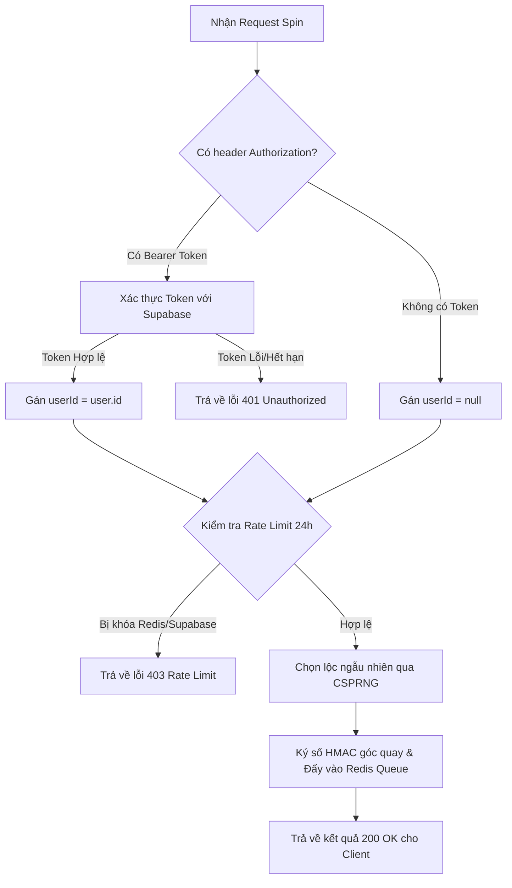

# BÁO CÁO PHÂN TÍCH HỆ THỐNG CƠ SỞ DỮ LIỆU, XỬ LÝ LƯỢT QUAY & HÀNG ĐỢI ĐỒNG BỘ NGOẠI TUYẾN

Báo cáo này tập trung phân tích chi tiết cấu trúc cơ sở dữ liệu Supabase/PostgreSQL, cơ chế đồng bộ hàng đợi ngoại tuyến (Sync Queue) tại [api/sync-queue.ts](file:///d:/khoinghiep/vongquay/api/sync-queue.ts), và logic xử lý lượt quay thưởng tại [api/spin.ts](file:///d:/khoinghiep/vongquay/api/spin.ts) thuộc dự án Vòng Quay Lộc Chúa. Báo cáo đánh giá tính toàn vẹn dữ liệu, các lỗ hổng phòng chống gian lận (anti-cheat), hiệu năng của hàng đợi và đưa ra các phương án tối ưu hóa mã nguồn cụ thể.

---

## 1. Hiện Trạng & Phát Hiện (Current State & Findings)

### 1.1. Cấu trúc Cơ sở dữ liệu và Cơ chế lưu trữ kép (Online/Offline)
Dựa trên mã nguồn tại [db.ts](file:///d:/khoinghiep/vongquay/src/services/db.ts), hệ thống sử dụng mô hình cơ sở dữ liệu quan hệ trên PostgreSQL (thông qua Supabase) tích hợp lưu trữ cục bộ phía Client (IndexedDB & LocalStorage) nhằm hỗ trợ khả năng hoạt động ngoại tuyến (Offline-first):
- **Bảng dữ liệu chính trên Supabase**:
  - `parishes` (Giáo xứ): Quản lý thông tin giáo xứ, định danh qua `slug` và sở hữu bởi `owner_id`.
  - `wheels` (Vòng quay): Lưu cấu hình vòng quay. Khi chạy Online, cấu hình chi tiết (như giao diện, âm thanh, slot hiển thị) được lưu trong cột JSON `config`. Khi chạy Offline, cấu hình được phẳng hóa (flatten) trực tiếp vào đối tượng `Wheel`.
  - `blessings` (Lộc Lời Chúa): Chứa danh sách các câu Lời Chúa/ơn lành liên kết với `wheel_id`.
  - `spin_history` (Lịch sử quay): Ghi nhận chi tiết từng lượt quay của người dùng (`wheel_id`, `blessing_id`, `item_spun`, `session_id`, `ip_address`, `parishioner_name`, `created_at`).
- **Lưu trữ phía Client (IndexedDB & LocalStorage fallback)**:
  - `VongQuayBgmDB` (IndexedDB store `custom_bgms`): Lưu trữ các tệp âm thanh nhạc nền và hiệu ứng chiến thắng tự tải lên khi offline dưới dạng Blob, định danh bằng `wheelId` hoặc `win_sfx_{wheelId}`.
  - `VongQuayLocalDB` (IndexedDB store `sync_queue`): Hàng đợi chứa các tác vụ cần đồng bộ khi online trở lại.
  - `localStorage` fallback: Sử dụng làm bộ nhớ đệm dự phòng cho `sync_queue` (`vqlc_sync_queue`) và chứa dữ liệu giả lập môi trường local (`local_users`, `local_parishes`, `local_wheels`, `local_blessings`, `local_spin_history`).

### 1.2. Luồng xử lý lượt quay online ([api/spin.ts](file:///d:/khoinghiep/vongquay/api/spin.ts))
Khi người dùng thực hiện quay lộc ở chế độ Online:
1. **Xác thực yêu cầu**: Kiểm tra CORS động dựa trên danh sách trắng (localhost, `.vongquayloichua.com`, `.vercel.app`). Chỉ chấp nhận phương thức `POST`. Kiểm tra định dạng UUID của `wheel_id` bằng Regex để ngăn chặn lỗi cú pháp SQL injection/database.
2. **Xác thực người dùng**: API bắt buộc phải có tiêu đề `Authorization: Bearer <sessionToken>` chứa mã JWT hợp lệ của người dùng Supabase để trích xuất `userId`.
3. **Kiểm tra giới hạn lượt quay (Lock Duration / Anti-Cheat)**:
   - Nếu vòng quay có thiết lập khóa thời gian (`lock_duration !== 'none'`), hệ thống thực hiện kiểm tra kép:
     - **Tầng đệm (Redis)**: Sử dụng Upstash Redis để truy vấn đồng thời 3 khóa khóa: `spin_lock:${wheel_id}:${fingerprint}`, `spin_lock:${wheel_id}:${ip}`, và `spin_lock:${wheel_id}:${userId}`. Nếu bất kỳ khóa nào tồn tại, trả về lỗi `403 RATE_LIMIT_EXCEEDED` ngay lập tức.
     - **Tầng cơ sở dữ liệu (Supabase Fallback)**: Nếu Redis gặp sự cố hoặc không phát hiện khóa, hệ thống truy vấn bảng `spin_history` xem có lượt quay nào trong 24 giờ qua trùng khớp với `fingerprint`, `ip`, hoặc `userId` hay không.
4. **Chọn lộc ngẫu nhiên ở Server (CSPRNG)**: Sử dụng thuật toán sinh số ngẫu nhiên bảo mật bằng cryptographically secure pseudorandom number generator (`crypto.getRandomValues` hoặc `crypto.randomBytes`) để chọn phần lộc từ database, ngăn chặn việc Client tự gửi kết quả lên.
5. **Tính toán góc quay & Ký số (HMAC-SHA256)**:
   - Tính toán góc quay đích (`target_angle`) tương ứng với vị trí lộc được chọn trên vòng quay.
   - Ký số dữ liệu `${wheel_id}:${blessing.id}:${target_angle}` bằng khóa bí mật `SERVER_SPIN_SECRET` để tạo ra `signature`. Chữ ký này giúp Client xác minh góc quay trả về là do Server tính toán hợp lệ.
6. **Lưu lịch sử & Hàng đợi đồng bộ**:
   - Nếu cấu hình Redis khả dụng: Đẩy bản ghi lượt quay vào hàng đợi `spin_queue` (bằng lệnh `LPUSH`), đồng thời thiết lập các khóa chặn lượt quay với thời gian hết hạn (TTL) tương ứng với lock duration (mặc định 24 giờ - 86400 giây).
   - Nếu cấu hình `QSTASH_TOKEN` khả dụng, gửi một webhook bất đồng bộ thông qua Upstash QStash gọi tới API đồng bộ hàng đợi `/api/sync-queue` sau khoảng trễ 5 giây nhằm gom cụm (batch) ghi dữ liệu.
   - Nếu Redis không khả dụng: Ghi trực tiếp bản ghi vào bảng `spin_history` trên Supabase làm phương án dự phòng.

### 1.3. Luồng xử lý đồng bộ hàng đợi ([api/sync-queue.ts](file:///d:/khoinghiep/vongquay/api/sync-queue.ts))
Đây là một tiến trình chạy nền (trigger bởi cron job hoặc QStash webhook) để đồng bộ lượt quay từ Redis vào PostgreSQL:
1. **Kiểm soát trùng lặp (Distributed Lock)**: Lấy khóa phân tán `spin_sync_lock` trên Redis với thời gian hết hạn là 60 giây để ngăn các tiến trình chạy đè lên nhau.
2. **Đọc hàng đợi (FIFO)**: Đọc 200 phần tử từ cuối hàng đợi (`LRANGE spin_queue -200 -1`).
3. **Chèn hàng loạt (Bulk Insert)**: Thực hiện lệnh `.upsert(validRecords, { onConflict: 'id' })` vào bảng `spin_history` trên Supabase. Việc sử dụng `upsert` thay cho `insert` giúp tránh lỗi trùng lặp khóa chính khi thực hiện lại các tiến trình bị gián đoạn.
4. **Xử lý lỗi chi tiết**:
   - Nếu chèn hàng loạt thất bại, chuyển sang chế độ ghi từng bản ghi một từ cũ nhất đến mới nhất.
   - Nếu gặp lỗi vi phạm ràng buộc khóa ngoại (Foreign Key Constraint `23503`) trên trường `blessing_id` (thường do Admin đã xóa phần Lộc đó khỏi vòng quay trong lúc chờ đồng bộ), hệ thống tự động gán `blessing_id = null` và ghi lại.
   - Phân biệt lỗi vĩnh viễn (lỗi cú pháp, sai kiểu dữ liệu...) và lỗi tạm thời (mất kết nối DB). Đối với lỗi vĩnh viễn, đánh dấu bản ghi đã xử lý để loại khỏi hàng đợi, tránh tắc nghẽn. Đối với lỗi tạm thời, ngắt tiến trình để thử lại sau.
5. **Cắt hàng đợi**: Sử dụng lệnh `LTRIM` để loại bỏ các bản ghi đã đồng bộ thành công hoặc lỗi vĩnh viễn khỏi hàng đợi Redis, giải phóng khóa phân tán.

---

## 2. Các Vấn Đề Nghiêm Trọng / Điểm Yếu (Critical Issues & Weaknesses)

### 2.1. Yêu cầu Xác thực Bắt buộc tại API Spin ngăn chặn Giáo dân vãng lai quay Online
> [!CAUTION]
> **Mức độ nghiêm trọng: RẤT CAO (Lỗi logic nghiệp vụ)**
> 
> Trong [api/spin.ts:L120-138](file:///d:/khoinghiep/vongquay/api/spin.ts#L120-138), API yêu cầu bắt buộc phải xác thực Bearer token thông qua `supabase.auth.getUser(sessionToken)`. Nếu không có token, API trả về mã lỗi `401 Unauthorized`.
> 
> Tuy nhiên, giáo dân vãng lai truy cập công khai vào vòng quay để nhận Lộc Lời Chúa sẽ không có tài khoản và không đăng nhập. Do đó:
> - Client của giáo dân sẽ luôn nhận phản hồi `401 Unauthorized` từ API Online.
> - Client buộc phải kích hoạt chế độ **Offline Fallback** tại [db.ts:L1307](file:///d:/khoinghiep/vongquay/src/services/db.ts#L1307).
> - Kết quả là toàn bộ lịch sử quay của giáo dân chỉ được lưu cục bộ ở LocalStorage máy họ và **không bao giờ được đồng bộ lên máy chủ Supabase**.
> - Bảng thống kê lịch sử quay `spin_history` trên máy chủ sẽ hoàn toàn trống rỗng đối với giáo dân vãng lai (chỉ ghi nhận lượt quay thử của Admin có đăng nhập).

### 2.2. Sự mâu thuẫn và dư thừa mã nguồn giữa Client và Server về Offline Sync
> [!WARNING]
> **Mức độ nghiêm trọng: TRUNG BÌNH (Lỗi kiến trúc & Mã nguồn rác)**
> 
> Tồn tại sự mâu thuẫn lớn giữa logic Client ở [db.ts](file:///d:/khoinghiep/vongquay/src/services/db.ts) và API Server ở [api/spin.ts](file:///d:/khoinghiep/vongquay/api/spin.ts):
> 1. Trong [db.ts:L1338-1339](file:///d:/khoinghiep/vongquay/src/services/db.ts#L1338-1339), mã nguồn ghi rõ: `Offline spins are kept locally only to prevent forged spin results and avoid duplicate server-side recording when coming back online.`. Nghĩa là hệ thống **chủ động không đưa** lượt quay offline vào hàng đợi đồng bộ cục bộ (`sync_queue`).
> 2. Tuy nhiên, tại [db.ts:L1566-1605](file:///d:/khoinghiep/vongquay/src/services/db.ts#L1566-1605), lập trình viên vẫn viết mã nguồn cho sự kiện `syncOfflineActions` để xử lý `action_type === 'RECORD_SPIN'`, gửi request POST lên `/api/spin` kèm cờ `offline_sync: true` và payload chứa `item_spun`, `blessing_id`, `created_at`.
> 3. Phía Server, tại [api/spin.ts](file:///d:/khoinghiep/vongquay/api/spin.ts), API **hoàn toàn không** đọc hay xử lý các tham số `offline_sync`, `item_spun`, `blessing_id`, hay `created_at`. Nếu nhận được request sync này, API spin vẫn coi đó là lượt quay mới, tự sinh ngẫu nhiên một Lộc mới (dẫn tới kết quả Lộc lưu trên DB khác hoàn toàn với Lộc hiển thị cho giáo dân lúc offline) và bị chặn bởi rate limit hoặc lỗi 401.
> 
> Sự mâu thuẫn này gây dư thừa mã nguồn, tăng kích thước tệp và gây hiểu nhầm nghiêm trọng cho các kỹ sư bảo trì sau này.

### 2.3. Nguy cơ Tắc nghẽn hàng đợi (Head-of-Line Blocking) trên Redis
> [!IMPORTANT]
> **Mức độ nghiêm trọng: TRUNG BÌNH (Lỗi hiệu năng)**
> 
> Trong [api/sync-queue.ts:L293-304](file:///d:/khoinghiep/vongquay/api/sync-queue.ts#L293-304), khi xảy ra lỗi kết nối cơ sở dữ liệu tạm thời (transient database error) trong quá trình chèn đơn lẻ, tiến trình thực hiện lệnh `break` để dừng vòng lặp:
> ```typescript
> } else {
>   // Transient error (e.g. database offline), stop processing to retry later
>   console.error(`[Sync Worker] Transient database error for record ${record.id}. Aborting batch sync.`, singleError);
>   break;
> }
> ```
> Khi xảy ra `break`, hệ thống gọi `LTRIM` để loại bỏ các bản ghi đã chèn thành công trước đó ra khỏi Redis queue. Bản ghi bị lỗi transient vẫn nằm lại ở cuối hàng đợi để chờ lượt sync sau.
> Tuy nhiên, nếu bản ghi đó chứa lỗi logic không được PostgreSQL chấp nhận nhưng không nằm trong danh sách `isPermanentError` (hoặc do lỗi mạng cục bộ liên tục kết nối tới DB chứa bản ghi cụ thể đó), bản ghi lỗi này sẽ liên tục nằm ở vị trí đầu tiên cần xử lý của hàng đợi. Mỗi khi cron trigger chạy, nó sẽ đọc bản ghi lỗi đó, gặp lỗi, `break` tiến trình, và không bao giờ xử lý được các bản ghi hợp lệ xếp sau nó. Điều này dẫn tới tắc nghẽn toàn bộ hàng đợi đồng bộ.

### 2.4. Nguy cơ rò rỉ và lạm quyền từ Supabase Service Role Key
> [!WARNING]
> **Mức độ nghiêm trọng: THẤP - TRUNG BÌNH (Rủi ro bảo mật)**
> 
> Cả [api/spin.ts](file:///d:/khoinghiep/vongquay/api/spin.ts) và [api/sync-queue.ts](file:///d:/khoinghiep/vongquay/api/sync-queue.ts) đều khởi tạo Supabase Client bằng `SUPABASE_SERVICE_ROLE_KEY`. Khóa này bypass hoàn toàn tất cả các chính sách bảo mật Row Level Security (RLS) của cơ sở dữ liệu.
> Mặc dù việc chạy trên Vercel Serverless giúp che giấu biến môi trường này, nhưng việc lạm dụng Service Role Key cho các tác vụ của người dùng vãng lai (spin) mà không áp dụng cơ chế phân quyền nghiêm ngặt hoặc kiểm tra chặt chẽ đầu vào là một thói quen lập trình tiềm ẩn rủi ro cao nếu mã nguồn bị lộ hoặc có lỗi Injection.

---

## 3. Phương Án Giải Quyết Chi Tiết (Proposed Solution & Code Proposals)

### 3.1. Sửa đổi luồng xác thực tại API Spin để hỗ trợ giáo dân vãng lai
Đề xuất thay đổi cơ chế kiểm tra token trong [api/spin.ts](file:///d:/khoinghiep/vongquay/api/spin.ts) từ **bắt buộc** sang **tùy chọn** (optional). Nếu có token của Admin/Owner thì ghi nhận `userId` để khóa chính xác hơn; nếu không có token thì vẫn cho phép chạy tiếp bằng cách định danh qua `fingerprint` và `ip`.

#### Sơ đồ logic đề xuất:


#### Code Proposal thay thế đoạn xác thực tại `api/spin.ts`:

```diff
-    // 5.b Verify authenticated Supabase user (session token is mandatory)
-    const authHeader = req.headers['authorization'] as string || '';
-    if (!authHeader || !authHeader.startsWith('Bearer ')) {
-      return res.status(401).json({ error: 'Unauthorized: Missing or invalid Authorization header' });
-    }
-
-    const sessionToken = authHeader.substring(7);
-    let userId = '';
-
-    try {
-      const { data: { user }, error: userError } = await supabase.auth.getUser(sessionToken);
-      if (userError || !user) {
-        return res.status(401).json({ error: 'Unauthorized: Invalid session token' });
-      }
-      userId = user.id;
-    } catch (err) {
-      console.error('Supabase session token verification failed:', err);
-      return res.status(401).json({ error: 'Unauthorized: Token verification failed' });
-    }
+    // 5.b Verify authenticated Supabase user (session token is optional to allow anonymous parishioners)
+    const authHeader = req.headers['authorization'] as string || '';
+    let userId = '';
+
+    if (authHeader && authHeader.startsWith('Bearer ')) {
+      const sessionToken = authHeader.substring(7);
+      try {
+        const { data: { user }, error: userError } = await supabase.auth.getUser(sessionToken);
+        if (user && !userError) {
+          userId = user.id;
+        } else {
+          // If authorization header is provided but invalid, reject for security
+          return res.status(401).json({ error: 'Unauthorized: Invalid session token' });
+        }
+      } catch (err) {
+        console.error('Supabase session token verification failed:', err);
+        return res.status(401).json({ error: 'Unauthorized: Token verification failed' });
+      }
+    }
```

### 3.2. Giải quyết mâu thuẫn Offline Spin Sync (Chọn 1 trong 2 phương án)

#### Phương án A: Dọn dẹp mã nguồn thừa (Khuyên dùng - Tuân thủ Quy tắc đơn giản)
Nếu hệ thống kiên quyết không đồng bộ lượt quay offline lên server để ngăn ngừa cheat kết quả (như ghi chú tại dòng 1338 của `db.ts`), ta cần dọn dẹp các đoạn mã nguồn dư thừa không bao giờ chạy tới.

Sửa đổi tại [db.ts](file:///d:/khoinghiep/vongquay/src/services/db.ts):
- Loại bỏ hoàn toàn khối lệnh xử lý `RECORD_SPIN` tại hàm `syncOfflineActions`.

```diff
-        if (action.action_type === 'RECORD_SPIN') {
-          let session_token = '';
-          if (supabase) {
-            const { data: sessionData } = await supabase.auth.getSession();
-            session_token = sessionData?.session?.access_token || '';
-          }
-
-          const headers: Record<string, string> = {
-            'Content-Type': 'application/json',
-          };
-          if (session_token) {
-            headers['Authorization'] = `Bearer ${session_token}`;
-          }
-
-          const payload = action.payload as {
-            wheel_id: string;
-            blessing_id?: string;
-            item_spun: string;
-            session_id?: string;
-            created_at?: string;
-            fingerprint?: string;
-          };
-          const response = await fetch('/api/spin', {
-            method: 'POST',
-            headers,
-            body: JSON.stringify({
-              wheel_id: payload.wheel_id,
-              blessing_id: payload.blessing_id,
-              item_spun: payload.item_spun,
-              session_id: payload.session_id,
-              created_at: payload.created_at,
-              fingerprint: payload.fingerprint,
-              offline_sync: true
-            })
-          });
-
-          if (!response.ok) {
-            throw new Error(`Server responded with ${response.status}`);
-          }
-        }
```

#### Phương án B: Nâng cấp API Spin để hỗ trợ đồng bộ Offline an toàn
Nếu muốn bảo toàn dữ liệu thống kê lượt quay offline của giáo dân, ta cần nâng cấp cả Client và Server:

1. **Phía Client ([db.ts](file:///d:/khoinghiep/vongquay/src/services/db.ts))**: Kích hoạt việc đẩy lượt quay offline vào `sync_queue` cục bộ khi xảy ra lỗi mạng.
2. **Phía Server ([api/spin.ts](file:///d:/khoinghiep/vongquay/api/spin.ts))**: Cho phép nhận tham số `offline_sync: true`. Khi cờ này được kích hoạt:
   - Server không sinh lộc mới mà lấy trực tiếp `blessing_id` và `item_spun` từ payload do client gửi lên.
   - Bỏ qua kiểm tra rate limit 24h đối với client (vì lượt quay này thực chất đã diễn ra trong quá khứ).
   - Kiểm tra ràng buộc hợp lệ: `blessing_id` phải thực sự thuộc về `wheel_id` đó.
   - Ghi nhận `created_at` gốc do client truyền lên.

Code đề xuất tích hợp vào `api/spin.ts` để xử lý `offline_sync`:

```typescript
    // Thêm parse body ở đầu api/spin.ts
    const { wheel_id, fingerprint, name, group, offline_sync, blessing_id, item_spun, created_at } = (req.body || {}) as Record<string, any>;

    // Xử lý luồng riêng nếu là offline_sync
    if (offline_sync) {
      if (!blessing_id || !item_spun) {
        return res.status(400).json({ error: 'Missing offline blessing details' });
      }
      
      // Kiểm tra tính hợp lệ của blessing_id thuộc wheel_id trên database để tránh cheat lộc ngoài danh mục
      const { data: validBlessing, error: checkErr } = await supabase
        .from('blessings')
        .select('id')
        .eq('id', blessing_id)
        .eq('wheel_id', wheel_id)
        .maybeSingle();

      if (checkErr || !validBlessing) {
        return res.status(400).json({ error: 'Invalid blessing_id for this wheel' });
      }

      const spinRecord = {
        wheel_id,
        blessing_id: blessing_id,
        item_spun: item_spun,
        session_id: userId || fingerprint,
        ip_address: ip,
        parishioner_name: name || 'Ẩn danh',
        parishioner_group: group || '',
        created_at: created_at || new Date().toISOString(),
      };

      if (redisUrl && redisToken) {
        await fetch(redisUrl, {
          method: 'POST',
          headers: { Authorization: `Bearer ${redisToken}`, 'Content-Type': 'application/json' },
          body: JSON.stringify([['LPUSH', 'spin_queue', JSON.stringify(spinRecord)]]),
        });
      } else {
        await supabase.from('spin_history').insert(spinRecord);
      }

      return res.status(200).json({ success: true, message: 'Offline spin synced successfully' });
    }
```

### 3.3. Khắc phục tắc nghẽn hàng đợi (Head-of-Line Blocking) tại Sync Worker
Bổ sung cơ chế giới hạn số lần thử lại (Max Retries) đối với mỗi phần tử trong hàng đợi Redis. Nếu một bản ghi gặp lỗi transient quá nhiều lần (ví dụ: 5 lần), ta cần đánh dấu nó là lỗi vĩnh viễn và đẩy ra khỏi queue (hoặc đưa vào một hàng đợi phụ Dead Letter Queue - DLQ để quản trị viên kiểm tra) thay vì làm nghẽn toàn bộ hệ thống.

Sửa đổi tại [api/sync-queue.ts](file:///d:/khoinghiep/vongquay/api/sync-queue.ts):
- Bổ sung trường `retry_count` vào cấu trúc bản ghi lưu trên Redis queue.
- Khi chèn đơn lẻ gặp lỗi transient, tăng `retry_count` lên 1. Nếu `retry_count > 5`, coi đó là lỗi vĩnh viễn để đẩy ra khỏi hàng đợi chính.

---
**Người báo cáo:** *Chuyên gia phân tích mã nguồn - Dự án Vòng Quay Lộc Chúa*
**Ngày thực hiện:** *15-06-2026*
