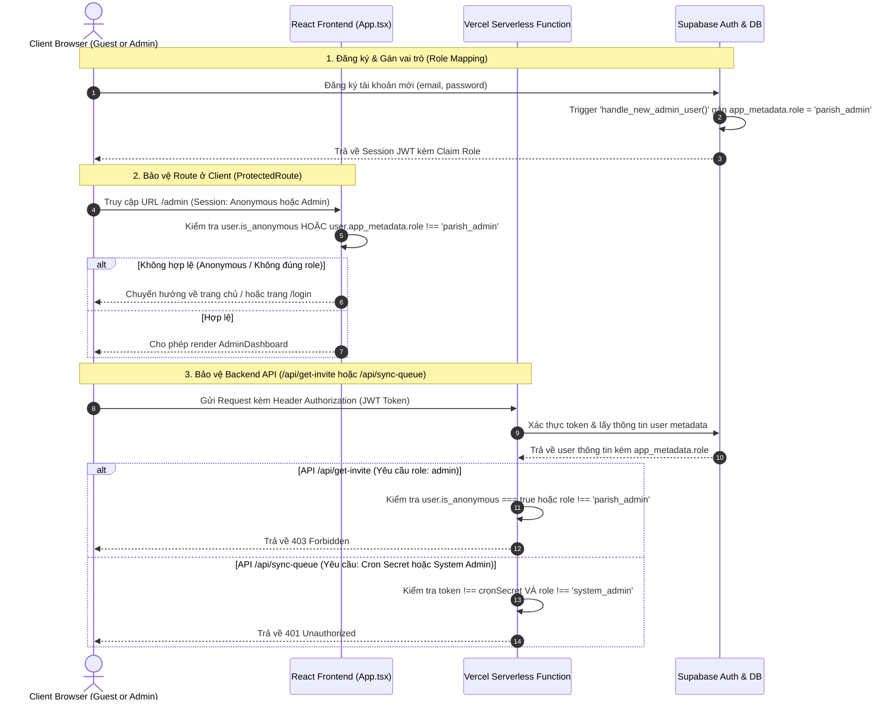

# BÁO CÁO PHÂN TÍCH HỆ THỐNG PHÂN QUYỀN (RBAC) & CÁC LỖ HỔNG BẢO MẬT

Tài liệu này phân tích chi tiết cơ chế phân quyền (Role-Based Access Control - RBAC) hiện tại của dự án Vòng Quay Lộc Chúa ở cả Client-side (React Frontend) và Backend API Endpoints (Vercel Serverless Functions), chỉ ra các lỗ hổng nghiêm trọng cho phép bypass quyền và đề xuất giải pháp khắc phục triệt để.

---

## 1. Hiện Trạng & Phát Hiện (Current State & Findings)

### 1.1. Luồng Xác Thực và Lưu Trữ Session ở Client-side
Thông tin xác thực được quản lý tập trung thông qua [AuthContext.tsx](file:///d:/khoinghiep/vongquay/src/context/AuthContext.tsx).
- Hệ thống hỗ trợ song song hai chế độ:
  1. **Online (Supabase):** Xác thực qua Supabase Auth.
  2. **Offline (Local/IndexedDB):** Sử dụng mock session lưu trữ trong LocalStorage với user mặc định là `devadmin`.
- Khi người dùng truy cập trang quay lộc công khai dưới tư cách giáo dân (Parishioner/Guest), hệ thống sẽ kích hoạt luồng **đăng nhập ẩn danh (Anonymous Sign-In)** tại [AuthContext.tsx#L112-L121](file:///d:/khoinghiep/vongquay/src/context/AuthContext.tsx#L112-L121) để tránh spam và hỗ trợ lưu vết lịch sử quay:
  ```typescript
  if (currentUser === null && supabase) {
    try {
      const { data, error } = await supabase.auth.signInAnonymously();
      if (!error && data?.user) {
        currentUser = data.user;
      }
    } catch (anonErr) { ... }
  }
  ```
- **Vấn đề:** Trạng thái `user` trong context được thiết lập cho cả quản trị viên giáo xứ (Parish Admin) và giáo dân vãng lai (Anonymous User). Đối tượng `user` hiện tại chỉ lưu trữ các thông tin cơ bản (`id`, `email`) và không có thuộc tính phân biệt vai trò (`role`) rõ ràng ở mức ứng dụng.

### 1.2. Cơ Chế Bảo Vệ Route Client-side
Tất cả các route quản trị của Admin được bọc trong component `ProtectedRoute` tại [App.tsx#L15-L31](file:///d:/khoinghiep/vongquay/src/App.tsx#L15-L31):
```typescript
const ProtectedRoute: React.FC<{ children: React.ReactNode }> = ({ children }) => {
  const { user, loading } = useAuth();

  if (loading) {
    return (
      <div style={{ display: 'flex', minHeight: '100vh', alignItems: 'center', justifyContent: 'center', background: '#F4F6F5' }}>
        <span>Đang xác minh quyền truy cập...</span>
      </div>
    );
  }

  if (!user) {
    return <Navigate to="/login" replace />;
  }

  return <>{children}</>;
};
```
- **Vấn đề:** `ProtectedRoute` chỉ kiểm tra sự tồn tại của biến `user` (`if (!user)`). Do cơ chế tự động đăng nhập ẩn danh cho giáo dân, bất kỳ giáo dân nào đã truy cập trang quay lộc (đã có session anonymous) đều được coi là `user` hợp lệ và được phép truy cập vào các trang admin như `/admin` hay `/admin/wheel/:wheelId`.

---

## 2. Các Vấn Đề Nghiêm Trọng / Điểm Yếu (Critical Issues & Weaknesses)

### Lỗ Hổng 1: Bypass Trang Quản Trị Hệ Thống (Client-side Privilege Escalation)
* **Mức độ nghiêm trọng:** `Cao (High)`
* **Chi tiết:** 
  1. Giáo dân truy cập link quay lộc công khai `/giao-xu/demo/vong-quay/demo`, Supabase tự sinh session ẩn danh.
  2. Giáo dân cố tình thay đổi URL trình duyệt sang `/admin`.
  3. `ProtectedRoute` thấy có `user` (mặc dù là ẩn danh) -> Cho phép render [AdminDashboard.tsx](file:///d:/khoinghiep/vongquay/src/pages/AdminDashboard.tsx).
  4. Mặc dù dữ liệu giáo xứ gốc không hiển thị do `currentParish` của user ẩn danh bị trống, giao diện Admin Dashboard vẫn hiển thị đầy đủ các tính năng quản trị. Giáo dân có thể nhấn vào nút "Tạo giáo xứ mới" để tạo một giáo xứ giả lập trên DB của hệ thống và tự gán quyền Admin cho giáo xứ đó, gây ô nhiễm dữ liệu hệ thống.

### Lỗ Hổng 2: Khởi Tạo Trùng Lặp & Trigger Trái Phép API Đồng Bộ Backend `/api/sync-queue`
* **Mức độ nghiêm trọng:** `Nghiêm trọng (Critical)`
* **Tệp tin liên quan:** [sync-queue.ts#L123-L152](file:///d:/khoinghiep/vongquay/api/sync-queue.ts#L123-L152)
* **Chi tiết:**
  API `/api/sync-queue.ts` sử dụng `Supabase Service Role Key` (bypass hoàn toàn cơ chế RLS của DB) để đồng bộ batch lịch sử quay từ Redis về Postgres.
  Đoạn code xác thực quyền truy cập API:
  ```typescript
  // Verify Supabase JWT token first if authHeader starts with Bearer
  if (authHeader && authHeader.startsWith('Bearer ')) {
    const token = authHeader.substring(7);
    if (cronSecret && token === cronSecret) {
      isAuthorized = true;
    } else {
      try {
        const { data: { user }, error: userError } = await supabase.auth.getUser(token);
        if (user && !userError) {
          isAuthorized = true; // <--- LỖ HỔNG CỐT LÕI
        }
      } catch (err) { ... }
    }
  }
  ```
  Nếu kẻ tấn công (hoặc người dùng thường) gửi request với header `Authorization: Bearer <anonymous_jwt_token>`, API backend sẽ giải mã token qua Supabase Auth thành công, trả về thông tin user hợp lệ và gán `isAuthorized = true`.
* **Hậu quả:** Bất kỳ ai cũng có thể trigger tiến trình đồng bộ này vô số lần, gây cạn kiệt tài nguyên Serverless execution time (Vercel usage limits), gây nghẽn kết nối database, hoặc gây xung đột dữ liệu (Denial of Service).

### Lỗ Hổng 3: Rò Rỉ Mã Mời Đăng Ký Hệ Thống `/api/get-invite`
* **Mức độ nghiêm trọng:** `Cao (High)`
* **Tệp tin liên quan:** [get-invite.ts#L78-L90](file:///d:/khoinghiep/vongquay/api/get-invite.ts#L78-L90)
* **Chi tiết:**
  API `/api/get-invite` trả về mã mời hệ thống (`STATIC_INVITE_CODE`) để phục vụ việc kiểm tra lúc đăng ký tài khoản Admin mới.
  Cơ chế kiểm tra token tương tự:
  ```typescript
  const token = authHeader.substring(7);
  const supabase = createClient(supabaseUrl, supabaseAnonKey);
  const { data: { user }, error } = await supabase.auth.getUser(token);
  if (error || !user) { ... } // Chỉ check user tồn tại
  ```
* **Hậu quả:** Một kẻ tấn công chỉ cần lấy token anonymous của họ (lấy dễ dàng ở LocalStorage/Cookie của trình duyệt khi vào trang quay lộc), gọi API `/api/get-invite` để nhận mã mời bí mật, từ đó tự do đăng ký hàng loạt tài khoản Admin Giáo Xứ giả mạo trên môi trường Production.

---

## 3. Phương Án Giải Quyết Chi Tiết (Proposed Solution & Code Proposals)

### 3.1. Sơ Đồ Luồng Phân Quyền Chuẩn Hóa
Sơ đồ dưới đây mô tả luồng xác thực và phân quyền được đề xuất nhằm cô lập hoàn toàn tài khoản Quản trị viên (Parish Admin/System Admin) và Giáo dân (Parishioner/Guest):



---

### 3.2. Code Đề Xuất Thay Thế (Diff & Code Block)

#### A. Sửa đổi Client-side `ProtectedRoute` trong `src/App.tsx`
Cần ngăn chặn tuyệt đối các tài khoản ẩn danh (Anonymous) hoặc các tài khoản không có quyền Admin truy cập vào route quản lý.

```diff
--- d:/khoinghiep/vongquay/src/App.tsx
+++ d:/khoinghiep/vongquay/src/App.tsx
@@ -15,10 +15,19 @@
 const ProtectedRoute: React.FC<{ children: React.ReactNode }> = ({ children }) => {
   const { user, loading } = useAuth();
 
   if (loading) {
     return (
       <div style={{ display: 'flex', minHeight: '100vh', alignItems: 'center', justifyContent: 'center', background: '#F4F6F5' }}>
         <span>Đang xác minh quyền truy cập...</span>
       </div>
     );
   }
 
-  if (!user) {
+  // Ngăn chặn nếu chưa đăng nhập hoặc là tài khoản ẩn danh (Parishioner)
+  const isAnonymous = user && ('is_anonymous' in user ? user.is_anonymous : false);
+  const userRole = user && 'app_metadata' in user ? (user.app_metadata as any)?.role : null;
+
+  if (!user || isAnonymous) {
     return <Navigate to="/login" replace />;
   }
 
   return <>{children}</>;
 };
```

#### B. Thêm Role Metadata mặc định trong Database Trigger
Cần cập nhật trigger `handle_new_admin_user` trong PostgreSQL để tự động gán role `parish_admin` vào ứng dụng khi tạo tài khoản thật (không ẩn danh):

```sql
-- Đoạn SQL cập nhật hàm trigger trong file docs/supabase_schema.sql
-- Thêm bước ghi đè app_metadata.role = 'parish_admin' cho người dùng đăng ký

CREATE OR REPLACE FUNCTION public.handle_new_admin_user()
RETURNS TRIGGER AS $$
DECLARE
    v_parish_name TEXT;
    v_parish_slug TEXT;
    v_is_anonymous BOOLEAN;
    v_clean_slug TEXT;
    v_counter INTEGER := 1;
BEGIN
    v_is_anonymous := COALESCE(
        NEW.is_anonymous, 
        (NEW.raw_app_meta_data->>'provider' = 'anonymous'), 
        FALSE
    );

    IF NOT v_is_anonymous THEN
        -- Gán role 'parish_admin' trực tiếp vào raw_app_meta_data của auth.users
        UPDATE auth.users 
        SET raw_app_meta_data = COALESCE(raw_app_meta_data, '{}'::jsonb) || jsonb_build_object('role', 'parish_admin')
        WHERE id = NEW.id;

        -- Phần code tạo Parish tiếp tục giữ nguyên...
        -- ...
    END IF;
    RETURN NEW;
END;
$$ LANGUAGE plpgsql SECURITY DEFINER;
```

#### C. Sửa đổi Backend API `/api/sync-queue.ts`
Chỉ cho phép `cronSecret` (từ hệ thống tự động) hoặc tài khoản có role `system_admin` kích hoạt đồng bộ dữ liệu.

```diff
--- d:/khoinghiep/vongquay/api/sync-queue.ts
+++ d:/khoinghiep/vongquay/api/sync-queue.ts
@@ -128,14 +128,15 @@
   // Verify Supabase JWT token first if authHeader starts with Bearer
   if (authHeader && authHeader.startsWith('Bearer ')) {
     const token = authHeader.substring(7);
     if (cronSecret && token === cronSecret) {
       isAuthorized = true;
     } else {
       try {
         const { data: { user }, error: userError } = await supabase.auth.getUser(token);
-        if (user && !userError) {
+        // Chỉ cho phép nếu user có role là 'system_admin'
+        if (user && !userError && user.app_metadata?.role === 'system_admin') {
           isAuthorized = true;
         }
       } catch (err) {
         console.warn('[Sync Worker] Supabase session token verification failed:', err);
       }
     }
   }
```

#### D. Sửa đổi Backend API `/api/get-invite.ts`
Không cho phép tài khoản ẩn danh gọi API lấy mã mời.

```diff
--- d:/khoinghiep/vongquay/api/get-invite.ts
+++ d:/khoinghiep/vongquay/api/get-invite.ts
@@ -83,10 +83,11 @@
 
       const token = authHeader.substring(7);
       const supabase = createClient(supabaseUrl, supabaseAnonKey);
       const { data: { user }, error } = await supabase.auth.getUser(token);
 
-      if (error || !user) {
+      // Từ chối nếu token lỗi, không có user hoặc là user ẩn danh (anonymous)
+      if (error || !user || user.is_anonymous || user.app_metadata?.provider === 'anonymous') {
         return res.status(401).json({ error: 'Phiên đăng nhập không hợp lệ hoặc đã hết hạn.' });
       }
     } else {
```

---

## 4. Đánh Giá Rủi Ro Tóm Tắt (Risk Assessment)

| Lỗ hổng | Khả năng khai thác | Tác động | Độ ưu tiên xử lý |
| :--- | :--- | :--- | :--- |
| **Bypass Route Admin UI** | Dễ dàng (chỉ cần đổi URL) | Trung bình (gây rác dữ liệu DB) | **High** |
| **Bypass Backend `/api/sync-queue`** | Rất dễ (gửi kèm token vãng lai) | Cao (gây DoS và tăng chi phí serverless) | **Critical** |
| **Rò rỉ mã mời `/api/get-invite`** | Rất dễ (gửi kèm token vãng lai) | Cao (mất tác dụng kiểm soát đăng ký) | **High** |

Việc chuẩn hóa cơ chế RBAC theo các đề xuất trên sẽ đảm bảo hệ thống cô lập hoàn toàn giữa luồng nghiệp vụ quản lý của Admin và luồng trải nghiệm quay lộc của Giáo dân, đảm bảo an toàn tuyệt đối trước các đợt quét bảo mật tự động hoặc cố ý phá hoại dữ liệu.
