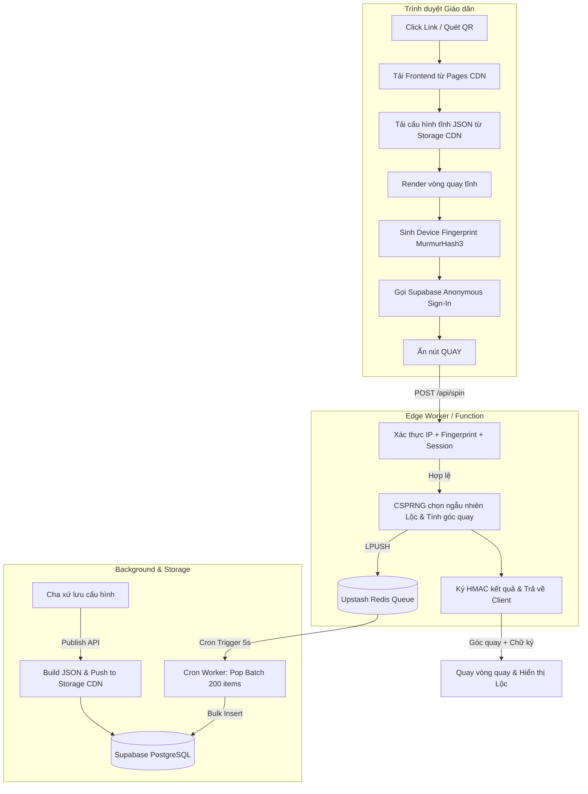

# KIẾN TRÚC HỆ THỐNG TỔNG THỂ: VÒNG QUAY LỜI CHÚA (1000+ CCU)
## Giải pháp Edge-First Serverless & Asynchronous Write Queue

Tài liệu này tích hợp toàn diện các phân tích thiết kế hệ thống chịu tải cực cao (1000+ Concurrent Users truy cập đồng thời vào các giờ cao điểm như Đêm Giao Thừa, Giáng Sinh), bảo mật tuyệt đối chống cheat kết quả và vận hành với chi phí tối ưu ($0/tháng).

---

## 1. THIẾT KẾ KIẾN TRÚC TỔNG THỂ (END-TO-END WORKFLOW)

Hệ thống hoạt động dựa trên triết lý **Edge-First**: Đọc dữ liệu tĩnh trực tiếp từ CDN ở Edge (Zero DB Hit) và ghi dữ liệu bất đồng bộ qua hàng đợi buffering (Write Queue) để giải phóng CPU của cơ sở dữ liệu chính.



---

## 2. LUỒNG DỮ LIỆU CHI TIẾT (DATA FLOW)

### Luồng 1: Admin cấu hình & xuất bản Vòng quay (Read Path Initialization)
1. **Đăng nhập**: Admin đăng nhập Dashboard bằng **Email OTP / Magic Link** (Passwordless) thông qua Supabase Auth.
2. **Lưu nháp**: Khi Admin chỉnh sửa cấu hình (Lời Chúa, nhạc nền, theme), dữ liệu nháp được tự động lưu ở LocalStorage của trình duyệt (`vqlc_draft_${wheel_id}`) để tránh mất mát khi rớt mạng hoặc lỡ tay đóng tab.
3. **Xuất bản**: Admin bấm "Lưu & Xuất bản" -> Client gửi dữ liệu lên DB (được bảo vệ bằng Row Level Security theo `parish_owner` và `auth.uid()`).
4. **Đồng bộ Edge**: Hệ thống (hoặc DB trigger/Edge function) tự động gộp cấu hình của giáo xứ (`parish`), vòng quay (`wheel`), và danh sách lộc (`blessings`) thành một file JSON duy nhất rồi đẩy lên **Supabase Storage public bucket** tại đường dẫn `/configs/[parishSlug]/[wheelSlug].json`.

### Luồng 2: Giáo dân tải trang (Edge Read Flow)
1. **Tải trang**: Giáo dân click link `vongquayloichua.com/giao-xu-tan-dinh/loc-xuan-2026`. Trình duyệt tải ngay lập tức các bundle tĩnh (JS/CSS/WebP/Audio) từ Cloudflare Pages CDN.
2. **Tải cấu hình**: Client gửi một request HTTP GET duy nhất để tải file `/configs/giao-xu-tan-dinh/loc-xuan-2026.json` từ Edge Storage CDN. Thời gian tải <30ms, tải trọng lên DB Postgres = 0.
3. **Định danh ẩn danh**:
   - Trình duyệt chạy **Device Fingerprint Engine** (vẽ canvas + WebGL + OS/Browser info hash MurmurHash3) kết hợp gọi **Supabase Anonymous Sign-In** để tạo session token ẩn danh duy nhất (`vqlc_anonymous_session`).
   - Điều này tạo ra một User ẩn danh thực sự trong bảng `auth.users` của Supabase, giúp phân quyền RLS an toàn mà không bắt giáo dân phải khai báo thông tin nhạy cảm.

### Luồng 3: Quay thưởng & Bảo mật chống cheat (Server-Controlled Spin Flow)
1. **Nhập thông tin**: Giáo dân nhập Tên + Giáo họ (lưu ở `localStorage` để tự động điền lần sau) và nhấn **[QUAY]**.
2. **Gửi request**: Client gửi request POST lên `/api/spin` (Supabase Edge Function) kèm các tham số: `wheel_id`, `fingerprint` (Device Fingerprint hash), và `session_token`.
3. **Kiểm tra giới hạn quay (Lock duration)**: Backend kiểm tra chéo IP của Client (`x-forwarded-for`) + Device Fingerprint hash + Anonymous ID trong DB/Redis xem thiết bị này đã quay trong vòng 24h qua chưa. Nếu đã quay, trả về lỗi `403 Forbidden` kèm thông báo.
4. **Quyết định kết quả tại Server**:
   - Sử dụng **CSPRNG** (`crypto.getRandomValues`) chọn ngẫu nhiên 1 Lộc trong danh sách.
   - Tính toán góc dừng (`target_angle`) tương ứng trên vòng quay.
   - Tạo mã chữ ký bảo mật **HMAC_SHA256** dựa trên chuỗi: `${wheel_id}:${blessing_id}:${target_angle}` và một Server Secret Key để chứng thực gói tin kết quả.
   - Đẩy payload lịch sử quay (`spin_history` log) vào hàng đợi **Upstash Redis LPUSH `spin_queue`** (chạy trên RAM cực nhanh, API Edge trả về ngay lập tức cho client trong vòng <10ms).

### Luồng 4: Hiển thị kết quả & Lưu trữ bất đồng bộ (Asynchronous Sync Flow)
1. **Hiển thị**: Client nhận kết quả từ Edge Function, verify chữ ký HMAC để đảm bảo an toàn, chạy hiệu ứng quay kim dừng chính xác ở góc `target_angle` và hiển thị thiệp Lộc Lời Chúa.
2. **Ghi DB bất đồng bộ**: **Background Sync Worker** (Cloudflare Worker Cron) chạy định kỳ mỗi 5-10 giây:
   - Gọi REST API của Upstash Redis để pop hàng loạt (ví dụ: gộp tối đa 200 bản ghi) bằng lệnh `LRANGE spin_queue 0 199` và xóa bằng `LTRIM spin_queue 200 -1`.
   - Thực hiện một câu lệnh **Bulk Insert** duy nhất bằng API Supabase Service Role (hoặc direct SQL) để đưa các bản ghi lịch sử quay vào bảng `spin_history`.
   - Cách này giảm thiểu tải CPU của Postgres 95% và tránh nghẽn khoá bảng do ghi đồng thời.

---

## 3. ĐÁNH GIÁ TÍNH KHẢ THI VÀ CHI PHÍ VẬN HÀNH

Hệ thống được thiết kế tối ưu để có thể triển khai hoàn toàn trên **Free Tier** của các nhà cung cấp dịch vụ cloud phổ biến:

| Dịch vụ | Thành phần đảm nhiệm | Hạn mức Free Tier | Tính toán tải thực tế khi 1000 CCU | Chi phí |
| :--- | :--- | :--- | :--- | :--- |
| **Cloudflare Pages** | Hosting Static Frontend | Unlimited bandwidth | Load 1000+ lượt tải trang tĩnh trong 1 phút | **$0** |
| **Supabase Storage (CDN)** | Phân phối file cấu hình JSON | 1 GB Storage + 5 GB Bandwidth | 1000 requests tải file JSON dung lượng ~20KB | **$0** |
| **Supabase Database** | PostgreSQL chính (Admin & Audit) | 500 MB DB | Chỉ nhận 1 query Bulk Insert mỗi 5-10s từ Sync Worker | **$0** |
| **Upstash Redis** | Hàng đợi Write Queue | 10,000 requests/ngày | 1000 requests LPUSH + 240 requests LRANGE/LTRIM | **$0** |
| **Cloudflare Workers** | Edge API & Cron Sync Worker | 100,000 requests/ngày | 1000 requests gọi API spin + 120 requests Cron Trigger | **$0** |

---

## 4. HƯỚNG DẪN TRIỂN KHAI CHI TIẾT CHO LẬP TRÌNH VIÊN (DEVELOPER GUIDE)

### Bước 1: Thiết lập Database Schema & RLS Policies (Supabase Postgres)

```sql
-- 1. Bảng Giáo xứ
CREATE TABLE parishes (
    id UUID PRIMARY KEY DEFAULT gen_random_uuid(),
    name VARCHAR(255) NOT NULL,
    slug VARCHAR(100) UNIQUE NOT NULL,
    owner_id UUID REFERENCES auth.users(id),
    status VARCHAR(50) DEFAULT 'active',
    created_at TIMESTAMP WITH TIME ZONE DEFAULT CURRENT_TIMESTAMP
);
CREATE INDEX idx_parishes_slug ON parishes(slug);

-- 2. Bảng Vòng Quay
CREATE TABLE wheels (
    id UUID PRIMARY KEY DEFAULT gen_random_uuid(),
    parish_id UUID REFERENCES parishes(id) ON DELETE CASCADE,
    title VARCHAR(255) NOT NULL,
    config JSONB NOT NULL,
    lock_duration VARCHAR(50) DEFAULT '24h', -- 'none', '24h', 'forever'
    is_active BOOLEAN DEFAULT TRUE,
    created_at TIMESTAMP WITH TIME ZONE DEFAULT CURRENT_TIMESTAMP
);

-- 3. Bảng Lộc / Lời Chúa
CREATE TABLE blessings (
    id UUID PRIMARY KEY DEFAULT gen_random_uuid(),
    wheel_id UUID REFERENCES wheels(id) ON DELETE CASCADE,
    category VARCHAR(255) NOT NULL,
    quote VARCHAR(100) NOT NULL,
    text TEXT NOT NULL,
    created_at TIMESTAMP WITH TIME ZONE DEFAULT CURRENT_TIMESTAMP
);
CREATE INDEX idx_blessings_wheel ON blessings(wheel_id);

-- 4. Bảng Lịch sử quay
CREATE TABLE spin_history (
    id UUID PRIMARY KEY DEFAULT gen_random_uuid(),
    wheel_id UUID REFERENCES wheels(id) ON DELETE CASCADE,
    blessing_id UUID REFERENCES blessings(id) ON DELETE SET NULL,
    item_spun VARCHAR(255) NOT NULL,
    session_id VARCHAR(255) NOT NULL,
    ip_address VARCHAR(45) NOT NULL,
    created_at TIMESTAMP WITH TIME ZONE DEFAULT CURRENT_TIMESTAMP
);
CREATE INDEX idx_spin_history_limit ON spin_history(wheel_id, session_id, ip_address);

-- 5. Cấu hình Row Level Security (RLS)
ALTER TABLE parishes ENABLE ROW LEVEL SECURITY;
ALTER TABLE wheels ENABLE ROW LEVEL SECURITY;
ALTER TABLE blessings ENABLE ROW LEVEL SECURITY;

-- Policy cho wheels: Mọi người được xem vòng quay active
CREATE POLICY "Allow public read active wheels" ON wheels 
    FOR SELECT USING (is_active = true);

-- Policy cho wheels: Chỉ admin sở hữu giáo xứ mới được chỉnh sửa
CREATE POLICY "Allow modify wheels for parish owner" ON wheels 
    FOR ALL USING (
        EXISTS (
            SELECT 1 FROM parishes 
            WHERE parishes.id = wheels.parish_id AND parishes.owner_id = auth.uid()
        )
    );
```

### Bước 2: Thiết lập Client-Side Fingerprint & Anonymous Auth

```typescript
// src/utils/fingerprint.ts
export async function getDeviceFingerprint(): Promise<string> {
  const canvas = document.createElement('canvas');
  const gl = canvas.getContext('webgl') as WebGLRenderingContext;
  const debugInfo = gl ? gl.getExtension('WEBGL_debug_renderer_info') : null;
  const renderer = debugInfo ? gl.getParameter(debugInfo.UNMASKED_RENDERER_VENDOR_SGIX) : '';
  
  const payload = [
    navigator.userAgent,
    navigator.language,
    new Date().getTimezoneOffset(),
    screen.colorDepth,
    `${screen.width}x${screen.height}`,
    renderer
  ].join('|');

  let hash = 0;
  for (let i = 0; i < payload.length; i++) {
    const ch = payload.charCodeAt(i);
    hash = ((hash << 5) - hash) + ch;
    hash = hash & hash;
  }
  return Math.abs(hash).toString(16);
}
```

### Bước 3: Triển khai API Quay thưởng (Supabase Edge Function / Cloudflare Worker)

```typescript
// Edge Function xử lý Quay số bảo mật
```

---

## 5. TỐI ƯU HÓA TÀI NGUYÊN CLIENT (OFFLINE MEDIA & LAZY LOAD AUDIO)

1. **Nén hình ảnh**: Định dạng **WebP** hoặc **AVIF**, dung lượng tối đa 150KB/ảnh.
2. **Nén âm thanh**: Nhạc nền BGM mono 64kbps-96kbps. SFX < 100KB, BGM < 1MB.
3. **Lazy Load Audio**: Chỉ khởi tạo Audio khi người dùng tương tác lần đầu.
4. **IndexedDB**: Lưu trữ Blob offline cho âm nhạc và background.
